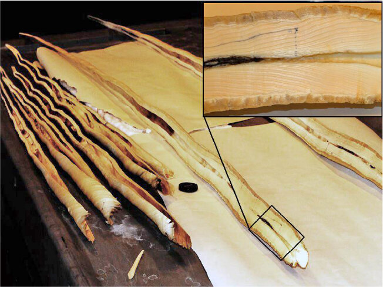

```{r setup, echo = FALSE, eval = TRUE}
knitr::opts_chunk$set(echo = FALSE, eval = TRUE,
                      comment = NA, warning = FALSE,
                      message = FALSE)
knitr::opts_chunk$set(fig.width = 6, fig.height = 3, fig.align = "center")
```

```{r}
library(ggplot2)
library(kableExtra)
library(latex2exp)
library(patchwork)
library(reshape2)

set.seed(15)

source("../../R/2_tusk/utils/simulation.R")
```

\newpage

Comme nous avons pu le voir précédemment, le narval est une espèce de cétacés vivant dans l’océan Arctique.
Ces animaux d’une durée de vie moyenne de 50 ans, possèdent deux dents.
Chez les femelles, les dents restent à l’intérieur de la boîte crânienne, tandis que pour les mâles, la canine gauche s’allonge et prend la forme d’une corne, comme le montre la Figure \@ref(fig:img1).
Elle commence à pousser au travers de la lèvre supérieure gauche dès l'âge d’un an lors de la puberté et croît jusqu'à la maturité sexuelle, entre 8 et 9 ans.
Cette défense torsadée possède des fonctionnalités et propriétés uniques dans la nature.
Elle contient des millions de terminaisons nerveuses, ce qui en fait un organe de sensoriel très développé [@narval].

```{r img1, out.width = "50%", fig.cap = "Vue de face d'un narval et de sa dent. \\cite{narval-img}"}
knitr::include_graphics('./img/img.928.png')
```

Certains chercheurs danois, comme Eva Garde, s'intéressent plus particulièrement à l'étude de cette défense.
Leur objectif est d'estimer la durée de vie du narval à travers l’information contenue dans cette dent.
Pour mener cette étude, plusieurs découpes latérales des dents d'animaux décédés ont été réalisées.
Comme nous pouvons le voir sur la Figure \@ref(fig:img2), ces découpes se présentent sous la forme d’une séquence de sillons ou de couches et détiennent plusieurs types d’informations.
En effet, nous remarquons la présence de marqueurs saisonniers sur les sillons au cours de la croissance des dents.
Ces derniers créent des motifs sinusoïdaux.
La fréquence et la forme de ces sinusoïdes varient d’une année à l'autre selon la variabilité de la durée ou de l'intensité des saisons [@tusk].
L’information portée par les motifs à l’intérieur des défenses est donc logiquement liée à la durée de vie de l’animal.

```{r img2, fig.cap = "Présentation de l’allure d’une section en longueur d’une dent de narval. \\cite{tusk}"}

```

Le premier objectif pour cette problématique est le choix d’un modèle sinusoïdal pouvant représenter l’information contenue dans la dent de l’animal.
À partir de cette forme de modèle et d’observations, le deuxième objectif sur lequel nous allons nous concentrer est celui de l’estimation des paramètres du modèle sinusoïdal.
Nous présentons donc dans les parties suivantes, le modèle envisagé ici ainsi que notre démarche d’estimation de ces paramètres à partir d’un algorithme SAEM.

# Modèle sinusoïdal

Comme nous l’avons évoqué précédemment, les motifs sinusoïdaux observés sont le reflet de la variabilité des saisons, ainsi ce motif n’est pas répété identiquement en fonction du temps.
Ces variations complexifient donc la modélisation de cette information.

Les observations le long de la défense sont notées $Y_i$ pour $i=1, \ldots, n$, avec la position correspondante sur la dent notée $x_i$.
Le modèle est le suivant : 
$$Y_i = f(x_i, \varphi) + \varepsilon_i$$
avec $\varepsilon_i$ un bruit aléatoire suivant une loi normale de moyenne $0$ et de variance $\omega^2$.

La fonction de régression $f(x, \varphi)$ est une fonction périodique sinusoïdale telle que : 
$$f(x, \varphi) = A \sin(g(x)  +b) + B \sin(2g(x) + 2b + \frac{\pi}{2})$$
avec $$g(x) = ax + \xi_x$$
et  finalement $\xi_x$, un processus aléatoire d'Ornstein-Uhlenbeck, tel que :
$$d\xi_x = -\beta \xi_xdx + \sigma dW_x$$
Dont la solution est donnée par :
$$\xi_{x+\Delta} = \xi_x \psi + \int_{x}^{x+\Delta} \sigma e^{\beta(s-x)}dW_s $$
de sorte que la densité de transition soit définie telle que :
$$p(\xi_{x + \delta} | \xi_x) = \mathcal{N}(\xi_x \psi, \frac{\sigma^2}{2\beta}(1 - \psi^2))$$

Dans ce cadre, l'objectif est donc d'estimer les paramètres $\theta$ :

- $\varphi = (A, B, a, b)$,
- $\omega$,
- $\psi = e^{-\beta \Delta}$, où $\Delta$ est l'intervalle de temps entre deux observations,
- $\gamma^2 = \frac{\sigma^2}{2\beta}(1 - \psi^2)$.

Une réalisation de ce modèle est présentée sur la Figure \@ref(fig:mdl). 

```{r mdl, fig.cap = "Simulation des observations $Y$, avec les paramètres suivants : $A=0.5$, $B=-0.25$, $b=1$, $a=0.1$, $\\beta=0.05$, $\\sigma=0.1$, $\\omega=0.01$ et $\\delta=1$."}
ggplot() +
  geom_line(aes(x = x, y = Y))
```

# Estimation des paramètres à partir d'un algorithme SAEM 

Afin d'estimer les paramètres $\theta$ du modèle présenté dans la partie précédente, nous avons implémenté une procedure reposant sur l'algorithme SAEM.
Nous allons d'abord présenter le principe d'un algorithme EM, puis celui de son approximation stochastique : l'algorithme SAEM.
Durant sa présentation, nous détaillerons les algorithmes MCMC et SMC avant de présenter l'algorithme complet.

## Algorithme EM 

L'algorithme EM est basé sur la log-vraisemblance complète du modèle qui s'écrit de la manière suivante :
\begin{eqnarray*}
\log L(Y, \xi, \theta) &=& \sum_{i=1}^n \log p(Y_i | \xi_i) + \sum_{i=1}^n \log p(\xi_i | \xi_{i-1}) + \log p(\xi_1) \\
&=& -\sum_{i=1}^n \frac{(Y_i-f(x_i, \varphi))^2}{2\omega^2} - \frac{n}{2}\log(\omega^2) \\
&&- \sum_{i=1}^n \frac{(\xi_i - \xi_{i-1} \psi)^2}{\frac{\sigma^2}{\beta}(1 - \psi^2)} - \frac{n}{2} \log(\frac{\sigma^2}{2\beta}(1 - \psi^2)) \\
&=& -\sum_{i=1}^n \frac{(Y_i - f(x_i, \varphi))^2}{2\omega^2} - \frac{n}{2} \log(\omega^2) \\
&& -\sum_{i=1}^n \frac{(\xi_i - \xi_{i-1} \psi)^2}{2\gamma^2} - \frac{n}{2}\log(\gamma^2)
\end{eqnarray*}

Pour chaque itération $k$, l'algorithme EM procède aux deux étapes suivantes, étant donné la valeur courante des paramètres $\theta^k$. 

- étape E : calcul de $Q(\theta, \theta^k)$, l'espérance conditionnelle de la log-vraisemblance du modèle : 
$Q(\theta, \theta^k) \gets E(\log L(Y, \xi, \theta)|Y, \theta_k)$
- étape M : actualisation des paramètres $\theta^{k+1} = \arg\max_\theta Q(\theta, \theta^k)$.

Pour actualiser les paramètres, nous avons besoin des statistiques exhaustives.
Ces statistiques sont obtenues à partir du théorème de factorisation [?] et contiennent toute l'information de la vraisemblance.
Leurs définitions sont les suivantes :

\begin{eqnarray*}
S_1(\xi_i)& =& \frac{1}{n} \sum_{i=1}^n (Y_i - f(x_i(\xi_i), \varphi))^2\\
S_2(\xi_i) &=& \sum_{i=1}^n \xi_{i-1} \xi_i\\
S_3(\xi_i) &=& \sum_{i=1}^n \xi_{i-1}^2\\
S_4(\xi_i) &=& \sum_{i=1}^n \xi_i^2
\end{eqnarray*}

L'actualisation des paramètres dépend directement de ces statistiques.

## Simulation de $\xi_x$

Dans notre cas, la distribution conditionnelle $p(\xi|Y; \theta^k)$ n'est pas explicite en raison de la non-linéarité de notre fonction de régression $f(x, \varphi)$.
Nous pouvons donc utiliser un algorithme MCMC ou un algorithme SMC pour simuler selon cette distribution.

### Identifiabilité

Afin de justifier l'intérêt de l'utilisation d'un algorithme MCMC ou SMC, nous nous sommes intéressé à l'identifiabilité du modèle sinusoïdal.
Nous pouvons observer sur la Figure \@ref(fig:sim-xis) une trajectoire du processus $\xi_x$ cible ainsi que trois autres simulations de trajectoire du processus $\xi_x$ pour des valeurs de paramètres $\psi$ et $\gamma$ variant, obtenues selon le procédé suivant :

\begin{algorithmic}
\State $\xi \gets (0,\xi_2,...,\xi_n)$ \Comment{Initialisation de la première valeur}
\For{$i \in \{1, ..., n\}$}
  \State$\xi_i = \xi_{i-1}*\psi + \epsilon_{\xi}$, avec $\epsilon_{\xi} \sim N(0,\gamma^2)$
\EndFor
\end{algorithmic}

```{r sim-xis, fig.cap = "Présentation d'une trajectoire du processus $\\xi_x$ cible selon certains paramètres (en noir) et de trois autres trajectoires de ce processus simulées à partir des mêmes paramètres (en vert, bleu et rouge)."}
p1 <- rxi(psi.arg = 1 )
p2 <- rxi( gamma.arg = 1)
p3 <- rxi(psi.arg = 1, gamma.arg = 1)

g1 <- ggplot() +
  geom_line(aes(x = x, y = xi)) +
  labs(caption = "Référence", y = TeX("$\\xi$")) +
  theme(axis.title.x = element_blank(),
        plot.margin = margin(0, 1, 1, 0, "pt"))

g2 <- ggplot() +
  geom_line(aes(x = x, y = xi)) +
  geom_line(aes(x = x, y = p1), color = "green") +
  labs(caption = TeX("$\\psi$")) +
  theme(axis.title.x = element_blank(),
        axis.title.y = element_blank(),
        plot.margin = margin(0, 0, 1, 0, "pt"))

g3 <- ggplot() +
  geom_line(aes(x = x, y = xi)) +
  geom_line(aes(x = x, y = p2), color = "blue") +
  labs(caption = TeX("$\\gamma$"), y = TeX("$\\xi$")) +
  theme(plot.margin = margin(0, 0, 0, 0, "pt"))

g4 <- ggplot() +
  geom_line(aes(x = x, y = xi)) +
  geom_line(aes(x = x, y = p3), color = "red") +
  labs(caption = TeX("$\\psi, gamma$")) +
  theme(axis.title.y = element_blank(),
        plot.margin = margin(0, 0, 0, 0, "pt"))

(g1 + g2) / (g3 + g4)
```
 
Nous observons sur la Figure \@ref(fig:sim-xis) que plusieurs réalisations du processus $\xi$ conduisent à des trajectoires différentes. Comme attendu via la formule, la modification de $\psi$ impact la valeurs moyenne de $\xi$, et $\gamma$ sur la variance.
Ce résultat a un impact direct sur les observations $Y$ puisque comme nous pouvons le voir sur la Figure \@ref(fig:sim-ys), les observations $Y$ correspondant à des réalisations provenant d'un $\psi$ et d'un $\gamma$ modifiés, ne collent pas du tout à la distribution cible. Effectivement, la variabilité de simulation du paramètre $\xi$ entraine une variabilité sur les observations $Y$ qui se traduire par un décalage avec la distribution cible.
De plus, en faisant varier les paramètres $A$, $B$, $a$, et $b$, une différence sinusoïdale s'installe et éloignant fortement l'estimation de la distribution cible.

Les observations de $Y$ sont donc sensibles à la trajectoire du processus $\xi_x$ associé, ainsi que des paramètre $A$, $B$, $a$, et $b$.

Nous pouvons donc conclure que nos données sont identifiables. En effet, si nos paramètres sont proches de la réalité, notre estimation sera proche du signal réel. En revanche, si un des paramètres est mauvais, l'estimation sera faussé.


```{r sim-ys, fig.cap = "Distributions des $Y$ calculées à partir des trajectoires de $\\xi_x$ présentées sur la Figure \\ref(fig:sim-xis)."}
g1 <- ggplot() +
  geom_line(aes(x = x, y = Y)) +
  labs(caption = "Référence", y = TeX("$Y$")) +
  theme(axis.title.x = element_blank(),
        plot.margin = margin(0, 1, 1, 0, "pt"))

g2 <- ggplot() +
  geom_line(aes(x = x, y = Y)) +
  geom_line(aes(x = x, y = f(x, p3, A.arg = 1)), color = "green") +
  labs(caption = TeX("$\\psi, gamma$")) +
  theme(axis.title.x = element_blank(),
        axis.title.y = element_blank(),
        plot.margin = margin(0, 0, 1, 0, "pt"))

g3 <- ggplot() +
  geom_line(aes(x = x, y = Y)) +
  geom_line(aes(x = x, y = f(x, xi,A.arg = 1, B.arg = -0.5, a.arg = 0.2, b.arg = 2 )), color = "blue") +
  labs(caption = TeX("$A, B, a, b$"), y = TeX("$Y$")) +
  theme(plot.margin = margin(0, 0, 0, 0, "pt"))

g4 <- ggplot() +
  geom_line(aes(x = x, y = Y)) +
  geom_line(aes(x = x, y = f(x, p3,A.arg = 1, B.arg = -0.5, a.arg = 0.2, b.arg = 2 )), color = "red") +
  labs(caption = TeX("$\\psi,gamma, A, B, a, b$")) +
  theme(axis.title.y = element_blank(),
        plot.margin = margin(0, 0, 0, 0, "pt"))

(g1 + g2) / (g3 + g4)
```

### Algorithme MCMC

L'objectif de cet algorithme MCMC (Markov Chain Monte Carlo) est de simuler une trajectoire du processus $\xi_x$ à partir des observations $Y_i$ ainsi que des paramètres $\gamma^2$, $\psi$ et $\omega^2$.
L'algorithme programmé est plus précisément un algorithme de Gibbs - Metropolis Hasting avec marche aléatoire.

Effectivement, après l'initialisation d'une trajectoire $\xi_0 = (\xi_1,...,\xi_n)$, l'algorithme procède à M itérations.
La trajectoire du processus simulée peut donc s'écrire  $\xi_M = (\xi_1,...,\xi_n)$.

Plus précisément, pour chaque itération k, on calcule pour chaque position $x_i$, une valeur courante candidate $\xi_c$ avec une marche aléatoire : $\xi_c = \xi_k-1 + N(0, \delta_i^2)$.
Cela introduit un nouveau paramètre $\delta = (\delta_1,....,\delta_n)$ contrôlant la variance de la marche aléatoire.
Pour chacun de ses candidats, une log-probabilité d'acceptation est calculée de la façon suivante :
$$log(\alpha) = min(log(\frac{L(Y, \xi_c)}{L(Y, \xi_{k-1})}), 1)$$
avec :
\begin{eqnarray*}
\log(\frac{L(Y, \xi_c)}{L(Y, \xi_{k-1})}) &=& log(L(Y, \xi_c)) - log(L(Y, \xi_{k-1})) \\
&=& -\frac{1}{2 \omega^2} \sum_{i=1}^{n} (Y_i - f_\varphi(\xi_c))^2 - \frac{1}{2 \frac{\gamma^2}{2}} \sum_{i=1}^{n} (\xi_c - \xi_{k-1} \psi)^2 \\
&& + \frac{1}{2 \omega^2} \sum_{i=1}^{n} (Y_i - f_\varphi(\xi_{k-1}))^2 + \frac{1}{2 \frac{\gamma^2}{2}}\sum_{i=1}^{n} (\xi_{k-1} - \xi_{k-2} \psi)^2\\
\end{eqnarray*}

À partir de la valeur de cette log-probabilité ainsi que d'une réalisation d'une loi uniforme prenant ses valeurs entre 0 et 1, le candidat est soit rejeté, soit accepté, auquel cas, il remplace la valeur considérée à l'itération $k - 1$.

De plus, nous avons choisi de rendre le paramètre $\delta$ adaptatif en fonction du taux d'acceptation $acc\_rate_i$ pour chaque point au fil des itérations $k$.
Cela ajoute donc une étape d'actualisation à l'algorithme précédent, ce qui donne finalement l'Algorithme \@ref(alg:MCMC) :

\begin{algorithm}[H]
\caption{Algorithme MCMC de simulation d'une trajectoire du processus $\xi_x$.}
\label{alg:MCMC}
\begin{algorithmic}
\State $\delta \gets (\delta_1,....,\delta_n)$ \Comment{Initialisation du delta adaptatif}
\State $\delta_{AR} \gets 0.1$ \Comment{Pas d'évolution du delta adaptatif}
\State $acc\_rate \gets (acc\_rate_1, ..., acc\_rate_n)$ \Comment{Initialisation du vecteur de taux d'acceptation}
\State $acc\_rate_{target} \gets 0.23$ \Comment{Taux d'acceptation visé}
\For{$k \in \{1, ..., M\}$}
  \For{$i \in \{1, ..., n\}$}
    \State$\xi_c \sim \xi_{k-1} + \mathcal{N}(0, \delta_i^2)$ \Comment{Simulation de la valeur courante de $\xi$}
    \State$log{\alpha} \gets min(log(\frac{L(Y, \xi_c)}{L(Y, \xi_{k-1})}), 1)$\Comment{Calcul de la probabilité d'acceptation}
    \State$u \sim U[0,1]$\Comment {Tirage d'une réalisation de loi uniforme}
    \If{$\log{u} \leq \log{\alpha}$}
      \State$\xi_k = \xi_c$
    \Else
      \State$\xi_k = \xi_{k-1}$
    \EndIf
    \State $acc\_rate_i \gets$ mise à jour du taux d'acceptation
    \If{$acc\_rate_i < acc\_rate_{target} * (1 - .1)$}
      \State $ \delta_i \gets \delta_i * (1 - \delta_{AR})$ \Comment{Réduction du delta adaptatif}
    \ElsIf {$acc\_rate_i > acc\_rate_{target} * (1 - .1)$}
      \State $ \delta_i \gets \delta_i * (1 + \delta_{AR})$  \Comment{Augmentation du delta adaptatif}
    \EndIf
  \EndFor
\EndFor
\end{algorithmic}
\end{algorithm}

### Algorithme SMC

Comme pour l'algorithme MCMC, l'algorithme Sequential Monte-Carlo (SMC) - ou filtre particulaire - a pour objectif de simuler une trajectoire de $\xi_x$ à partir des observations $Y$ et des paramètres $\gamma^2$, $\psi$ et $\omega^2$.

Cependant son fonctionnement est assez différent : plutôt que d'accepter ou de rejeter un candidat pour chaque instant du processus selon un rapport de vraisemblance comme le fait l'approche MCMC, le SMC propose pour chaque instant $P$ réalisations (les particules) selon les $P$ estimations réalisées à l'instant précédent et associe à chacune des nouvelles réalisations un poids égale à la probabilité d'observer la valeur de $Y$ à l'instant courant conditionnellement à la réalisation simulée.
Il est alors possible de tirer avec remise parmi les particules en utilisant les poids normalisés comme probabilités de tirage et de conserver ainsi les particules permettant d'observer avec les plus fortes probabilités $Y$.
Une fois que le dernier instant du processus est atteint, il suffit de tirer un index selon les derniers poids calculés pour obtenir une trajectoire du processus. L'Algorithme \@ref(alg:SMC) détaille chacune de ces étapes :

\begin{algorithm}[H]
\caption{Algorithme SMC pour la simulation d'une trajectoire du processus $\xi_x$.}
\label{alg:SMC}
\begin{algorithmic}
\State $P \gets 500$ \Comment{Nombre de particules}
\State $w \gets []$ \Comment{Initialisation des poids associés aux particules}
\State $\hat{\xi} \gets [][]$ \Comment{Initialisation des trajectoires du processus}
\State $\widehat{\xi_c} \gets [0, ..., 0]$ \Comment{Initialisation des particules au premier instant du processus}
\State $\hat{\xi}[][1] \gets \widehat{\xi_c}$
\For{$i \in \{2, ..., n\}$}
    \For{$j \in \{1, ..., P\}$}
      \State $\widehat{\xi_c[j]} \sim \widehat{\xi[j][i-1]} * \psi + \mathcal{N}(0, \gamma^2)$ \Comment{Simulation d'une valeur courante de $\xi_i$ selon $\xi_{i-1}$}
      \State $w[j] \gets P(Y[i] | f(i, \widehat{\xi_c[j]}))$
      \Comment{Poids égale à la probabilité de $Y[i]$ conditionnellement à $\widehat{\xi_c[j]}$}
    \EndFor
    \For{$j \in \{1, ..., P\}$}
      \State $w[j] \gets \frac{w[j]}{\sum_{k=1}^P w[k]}$ \Comment{Normalisation}
    \EndFor
    \For{$j \in \{1, ..., P\}$}
      \State $idx \gets$ tirage probabiliste d'une particule en fonction des poids w
      \State $\widehat{\xi[j][i]} \gets \widehat{\xi_c[idx]}$ \Comment{Conservation de la particule $idx$}
    \EndFor
\EndFor
\State $idx \gets$ tirage probabiliste d'une trajectoire en fonction des poids w
\State $\widehat{\xi_x} \gets \widehat{\xi[idx][]}$
\end{algorithmic}
\end{algorithm}

## Algorithme SAEM

L'introduction d'une étape MCMC ou SMC conduit à la version stochastique de l'algorithme EM, à savoir l'algorithme SAEM.
Cet algorithme utilise les étapes de l’algorithme EM auxquelles s'ajoute une étape d'approximation stochastique.

Effectivement, pour chaque itération k, les étapes sont les suivantes :

- étape E : simulation d'une nouvelle trajectoire de $\xi^k$ à l'aide d'un algorithme MCMC considérant $p(\xi|Y; \theta^k)$ comme une distribution stationnaire,
- étape SA : approximation stochastique des statistiques exhaustives :

\begin{eqnarray*}
s_1^k &=& s_1^{k-1} + \alpha_k(S_1(\xi^k) - s_1^{k-1}) \\
s_2^k &=& s_2^{k-1} + \alpha_k(S_2(\xi^k) - s_2^{k-1}) \\
s_3^k &=& s_3^{k-1} + \alpha_k(S_3(\xi^k) - s_3^{k-1}) \\
s_4^k &=& s_4^{k-1} + \alpha_k(S_4(\xi^k) - s_4^{k-1}) \\
\end{eqnarray*}

- étape M : actualisation de $\theta^{k}$, à partir des formules suivantes qui utilisent les statistiques exhaustives $s^k$ :

\begin{eqnarray*}
\widehat{\varphi}^k &=& \arg\min_\varphi \sum_{i=1}^n \left(y_i - f(x_i(\xi_i^k), \varphi)\right)^2
\\
\widehat{\psi}^k &=& \frac{s_2^k}{s_3^k}\\
\widehat{\omega^{2}}^k &=& s_1^k\\
\widehat{\gamma^{2}}^k &=& \frac{1}{n}(\widehat{\psi^2}^ks_3^k-2\widehat{\psi}^ks_2^k+s_4^k)
\end{eqnarray*}

Au principe général d'un algorithme SAEM à $Q$ itérations, nous avons ajouté deux hyper-paramètres $M_{max}$ & $\alpha_{min}$ :
\begin{itemize}
\item Pour chaque itération $q$ de l'algorithme SAEM, au moins une itération de l'algorithme MCMC est effectuée.
Afin de pouvoir améliorer les performances au début de notre algorithme, nous avons décidé de fixer ce nombre d'itérations à 5 pour les $M_{max}$ premières itérations du SAEM, puis ensuite l'algorithme n'accomplis plus qu'une seule itération du MCMC.
Le paramètre $M_{max}$ est donc un hyper-paramètre de l'algorithme SAEM à choisir au préalable.
\item Le deuxième paramètre concerne l'approximation stochastique effectuée pour chacune des itérations $q$.
Effectivement, durant les premières itérations les approximations sont relativement éloignées de la valeur cible et donc sensiblement différentes entre elles.
Au contraire, dans les dernières itérations, étant donné le phénomène de convergence que nous devons observer, les approximations sont censées être plus proches de la valeur cible et également entre elles.
Afin de prendre en compte ce phénomène, nous faisons varier la valeur du paramètre de mémoire $\alpha$ permettant de tenir compte des valeurs précédemment estimées au fil des itérations à partir du paramètre $\alpha_{min}$ de la façon suivante :
\begin{itemize}
  \item dans un premier temps $\alpha = 1$ pour les $\alpha_{min}$ premières itérations, ce qui permet, d'appliquer la formule complète d'approximation,
  \item puis, pour les (Q-$\alpha_{min}$) dernières itérations, les alphas sont calculés de la façon suivante :
$$\alpha_{\alpha_{min}:Q} = \frac{1}{l^{0.8}}\text{, avec }l=1:(Q - \alpha_{min})$$
\end{itemize}
Ainsi le paramètre $\alpha$ décroît au fil des itérations à partir de la $\alpha_{min}$\textsuperscript{ième} itération.
Cette procédure permet de réduire l'importance du terme associé à $\alpha$ et d'augmenter donc l'influence de la valeur précédente pour ces itérations-là.
\end{itemize}

En prenant en compte ces deux paramètres supplémentaires, l'algorithme se présente comme l'Algorithme \@ref(alg:SAEM) :
\begin{algorithm}[H]
\caption{Algorithme SAEM complet}
\label{alg:SAEM}
\begin{algorithmic}
\State $s_1 \gets (s_1^1, ..., s_1^Q)$
\State $s_2 \gets (s_2^1, ..., s_2^Q)$
\State $s_3 \gets (s_3^1, ..., s_3^Q)$
\State $s_4 \gets (s_4^1, ..., s_4^Q)$

\State $\widehat{\varphi} \gets (\widehat{\varphi}^1, ..., \widehat{\varphi}^Q)$
\State $\widehat{\psi} \gets (\widehat{\psi}^1, ..., \widehat{\psi}^Q)$
\State $\widehat{\omega^2} \gets (\widehat{\omega^2}^1, ..., \widehat{\omega^2}^Q)$
\State $\widehat{\gamma^2} \gets (\widehat{\gamma^2}^1, ..., \widehat{\gamma^2}^Q)$

\State $\alpha \gets (\alpha_1, ..., \alpha_Q)$ \Comment{Initialisation du paramètre d'approximation $\alpha$}
\State $\alpha_{1:\alpha_{min}} \gets 1$ ; $\alpha_{\alpha_{min}:Q} \gets \frac{1}{l^{0.8}}$ avec $l=1:(Q - \alpha_{min})$

\State $M \gets (M_1, ..., M_Q)$\Comment{Initialisation du nombre d'itérations du MCMC}
\State $M_{1:M_{max}} \gets 5$ ; $M_{M_{max}+1:Q} \gets 1$ 
\For{$q \in \{1, ..., Q\}$}
  \State \Comment{Etape E}
    \State $\xi^q \gets$ MCMC (cf Algorithme \ref{alg:MCMC}) avec $M = M_q$ itérations et $\theta^{q-1}$, pour récupérer une trajectoire de $\xi$
  
  \State \Comment{Etape SA}
    \State $S_1 \gets \frac{1}{n}\sum_{i=1}^n (Y_i - f(x_i(\xi^q), \varphi))^2$\Comment{Calcul des statistiques exhaustives}
    \State $S_2 \gets \sum_{i=1}^n \xi_{i-1}^q\xi_i^q$
    \State $S_3 \gets \sum_{i=1}^n (\xi_{i-1}^q)^2$
    \State $S_4 \gets \sum_{i=1}^n (\xi_i^q)^2$
    \State \Comment{Mise à jour des approximations stochastiques}
    \State $s_1^q \gets s_1^{q-1} + \alpha_q(S_1(\xi^q) - s_1^{q-1})$
    \State $s_2^q \gets s_2^{q-1} + \alpha_q(S_2(\xi^q) - s_2^{q-1})$
    \State $s_3^q \gets s_3^{q-1} + \alpha_q(S_3(\xi^q) - s_3^{q-1})$
    \State $s_4^q \gets s_4^{q-1} + \alpha_q(S_4(\xi^q) - s_4^{q-1})$
    
  \State \Comment{Etape M} 
    \State $\widehat{\varphi}^q \gets \arg\min_\varphi \sum_{i=1}^n \left(Y_i - f(x_i(\xi_i^q), \varphi)\right)^2$\Comment{Actualisation de $\theta^q$}
    \State $\widehat{\psi}^q \gets \frac{s_2^q}{s_3^q}$
    \State $\widehat{\omega^{2}}^q \gets s_1^q$
    \State $\widehat{\gamma^{2}}^q \gets \frac{1}{n}(\widehat{\psi^2}^q s_3^q - 2\widehat{\psi}^q s_2^q + s_4^q)$
\EndFor
\end{algorithmic}
\end{algorithm}

# Simulation & résultats

Dans cette dernière partie, nous présentons les résultats d'estimation de $\xi_x$ par les algorithmes MCMC et SMC ; et plus largement de l'ensemble de coefficients $\theta$ par l'algorithme SAEM, ainsi que du plan d'expérience mis en place pour les valider.

## Estimation de $\xi_x$ par MCMC

Nous avons, dans un premier temps, testé l'efficacité de l'algorithme MCMC programmé indépendamment de l'algorithme SAEM.
Pour ce faire, nous avons fixé les valeurs des paramètres : $A = 0.5$, $B = -0.25$,  $b = 1$, $a = 0.1$, $\beta = 0.05$, $\sigma = 0.1$, $\omega = 0.01$ et $\delta = 1$.
Ces valeurs ont été utilisées pour simuler une trajectoire de $\xi_x$ cible avec une distribution $Y$ associée selon le modèle sinusoïdal.
L'algorithme MCMC a été réalisé avec $M = 150$ itérations et obtient, à partir de ces mêmes valeurs de paramètres et des observations $Y$, les résultats présentés sur la Figure \@ref(fig:result-MCMC).

```{r result-MCMC, fig.cap = "Superposition de la distribution $Y$ cible et de la trajectoire xi réellement utilisée (en bleu) ainsi que de la trajectoire de xi obtenue par l'algorithme MCMC et la distribution $Y$ qui l'utilise (en rouge)."}
source("../../R/2_tusk/utils/MCMC.R")

M <- 150
mcmc.obj <- mcmc.alg(Y, M)

g1 <- ggplot() +
  geom_line(aes(x = x, y = Y), color = "blue") +
  geom_line(aes(x = x, y = f(x, mcmc.obj$xi.c)), color = "red") +
  labs(caption = TeX("$Y$"), y = TeX("$Y$")) +
  theme(plot.margin = margin(0, 1, 0, 0, "pt"))

g2 <- ggplot() +
  geom_line(aes(x = x, y = xi), color = "blue") +
  geom_line(aes(x = x, y = mcmc.obj$xi.c), color = "red") +
  labs(caption = TeX("$\\xi$"), y = TeX("$\\xi$")) +
  theme(plot.margin = margin(0, 0, 0, 1, "pt"))

g1 + g2
```

La trajectoire de $\xi_x$ obtenue par le MCMC (en rouge) est très proche de celle à l'origine des observations $Y$.
Nous remarquons cependant que quelques points de $\xi$ sont très mal approchés par l'algorithme.
Effectivement pour plusieurs positions $x_i$, la distance entre la valeur originelle de $\xi_i$ et la valeur estimée par l'algorithme semble grande.
Cependant, ces différences n'influencent que très peu l'allure du signal $Y$, qui reste très satisfaisant.
Afin de comprendre la raison de ces erreurs, nous nous sommes intéressés au comportement du $\delta_i$ au fil des itérations, relativement à celui du taux d'acceptation $acc\_rate_i$ pour un des points concernés.
Nous avons comparé leur évolution pour la position $x_i$ où l'erreur est maximale et celle où elle est minimale.

```{r errors, fig.cap = "Distributions du taux d'acceptation et du delta adaptatif au fil des itérations pour deux positions différentes : celle pour laquelle l'erreur d'estimation est maximale et celle où elle est minimale."}
worst.idx <- which.max(abs(xi - mcmc.obj$xi.c))
best.idx <- which.min(abs(xi - mcmc.obj$xi.c))

coeff1 <- max(mcmc.obj$acceptance.rate[, worst.idx]) / max(mcmc.obj$delta[, worst.idx])
g1 <- ggplot(data = data.frame(x = 1:M), aes(x = x)) +
  geom_line(aes(y = mcmc.obj$acceptance.rate[, worst.idx]), color = "red") +
  geom_line(aes(y = mcmc.obj$delta[, worst.idx] * coeff1), color = "blue") +
  geom_hline(aes(yintercept = acceptance.target * 1.1), linetype = 2, color = "red") +
  geom_hline(aes(yintercept = acceptance.target * .9), linetype = 2, color = "red") +
  scale_y_continuous(name = "Taux d'acceptation", sec.axis = sec_axis(~. / coeff1, name = "")) +
  labs(caption = "Erreur maximale", x = "Itérations") +
  theme(plot.margin = margin(0, 1, 0, 0, "pt"),
        axis.title.y.left = element_text(colour="blue"),
        axis.text.y.left = element_text(colour="blue"),
        axis.title.y.right = element_blank(),
        axis.text.y.right = element_text(colour="red"))

coeff <- max(mcmc.obj$acceptance.rate[, best.idx]) / max(mcmc.obj$delta[, best.idx])
g2 <- ggplot(data = data.frame(x = 1:M), aes(x = x)) +
  geom_line(aes(y = mcmc.obj$acceptance.rate[, best.idx]), color = "red") +
  geom_line(aes(y = mcmc.obj$delta[, best.idx] * coeff), color = "blue") +
  geom_hline(aes(yintercept = acceptance.target * 1.1), linetype = 2, color = "red") +
  geom_hline(aes(yintercept = acceptance.target * .9), linetype = 2, color = "red") +
  scale_y_continuous(name = "", sec.axis = sec_axis(~. / coeff, name = "Delta")) +
  labs(caption = "Erreur minimale", x = "Itérations") +
  theme(plot.margin = margin(0, 0, 0, 1, "pt"),
        axis.title.y.left = element_blank(),
        axis.text.y.left = element_text(colour="blue"),
        axis.title.y.right = element_text(colour="red"),
        axis.text.y.right = element_text(colour="red"))

g1 + g2
```

Nous pouvons voir sur la Figure \@ref(fig:errors), que dans les deux cas, le delta adaptif évolue correctement.
Effectivement le taux d'acceptation est premièrement supérieur à la borne supérieure de notre seuil ce qui entraine l'augmentation de $\delta$.
Cette augmentation permet alors au taux de diminuer et donc de rentrer dans nos deux bornes de seuil, et $\delta$ stagne durant cette période.
Le taux d'acceptation devient ensuite trop bas, et alors la valeur de $\delta$ diminue afin de le faire augmenter à nouveau.
Nous remarquons seulement que, dans le cas concernant l'erreur maximale, l'évolution du taux d'acceptation est moins rapide que dans le cas de l'erreur minimale, par exemple il atteint l'intervalle de seuil environ vers la 40\textsuperscript{ième} itération contre environ la 20\textsuperscript{ième} pour le point où l'erreur est minimale.
Cela entraine une valeur maximale de $\delta$ bien plus élevée, d'environ 1.6 contre 0.3.
Malgré cette observation, nous n'identifions pas la source de ces points aberrants.
Cependant, étant donné que ceux-ci n'impactent pas l'estimation de la distribution des observations $Y$, l'algorithme MCMC programmé reste selon nous satisfaisant.

## Estimation de $\xi_x$ par SMC

```{r result-SMC, fig.cap = "Superposition de la distribution $Y$ cible et de la trajectoire xi réellement utilisée (en bleu) ainsi que de la trajectoire de xi obtenue par l'algorithme MCMC et la distribution $Y$ qui l'utilise (en rouge)."}
source("../../R/2_tusk/utils/SMC.R")

P <- 500
smc.obj <- smc.alg(Y, n.part = P)

g1 <- ggplot() +
  geom_line(aes(x = x, y = Y), color = "blue") +
  geom_line(aes(x = x, y = f(x, smc.obj$xi.c)), color = "red") +
  labs(caption = TeX("$Y$"), y = TeX("$Y$")) +
  theme(plot.margin = margin(0, 1, 0, 0, "pt"))

g2 <- ggplot() +
  geom_line(aes(x = x, y = xi), color = "blue") +
  geom_line(aes(x = x, y = smc.obj$xi.c), color = "red") +
  labs(caption = TeX("$\\xi$"), y = TeX("$\\xi$")) +
  theme(plot.margin = margin(0, 0, 0, 1, "pt"))

g1 + g2
```

## SAEM 

En gardant l'objectif d'estimer optimalement les paramètres utilisés pour obtenir une réalisation des observations $Y$ cibles, nous avons effectué $Q=500$ itérations de l'algorithme SAEM présenté précédemment.
Les paramètres $\alpha_{min}$ et $M_{max}$ ont été fixés après plusieurs tests et analyses graphiques aux valeurs suivantes : $\alpha_{min}=90$ et $M_{max}=20$, ce qui correspond à des valeurs retrouvées régulièrement dans la littérature.
La trajectoire de $\xi_x$ obtenue après les itérations ainsi que les observations $Y$ l'utilisant sont présentés sur la Figure \@ref(fig:result-SAEM).
Nous observons sur cette figure un léger décalage pour les premières positions de la trajectoire de $\xi_x$ estimée.
Malgré ce décalage, les deux courbes sont assez proches et nous retrouvons ce résultat pour la distribution de $Y$.

```{r}
source("../../R/2_tusk/utils/SAEM.R")

Q <- 500
saem.obj <- saem.alg(Y, Q)
```

```{r result-SAEM, fig.cap = "Superposition de la distribution $Y$ cible et de la trajectoire $\\xi$ réellement utilisée (en bleu) ainsi que de la trajectoire de $\\xi$ obtenue par l'algorithme SAEM et la distribution $Y$ qui l'utilise (en rouge)."}

g1 <- ggplot() +
  geom_line(aes(x = x, y = xi), color = "blue") +
  geom_line(aes(x = x, y = saem.obj$mcmc$xi.c), color = "red") +
  labs(y = TeX("$\\xi$"), caption = TeX("$\\xi$")) +
  theme(plot.margin = margin(0, 1, 0, 0, "pt"))

g2 <- ggplot() +
  geom_line(aes(x = x, y = Y), color = "blue") +
  geom_line(aes(x = x, y = f(x, saem.obj$mcmc$xi.c,
                             A.arg = saem.obj$A.c, B.arg = saem.obj$B.c,
                             a.arg = saem.obj$a.c, b.arg = saem.obj$b.c)), color = "red") +
  labs(y = TeX("$Y$"), caption = TeX("$Y$")) +
  theme(plot.margin = margin(0, 0, 0, 1, "pt"))

g1 + g2
```

Concernant l'estimation des autres paramètres du modèle, les chaines de Markov obtenues au fil des itérations pour les coefficients $\omega$, $\psi$ et $\gamma$ sont présentées sur la Figure \@ref(fig:coef1-SAEM).
Nous avons fait le choix d'initialiser ces 3 valeurs à $0.5$ pour la première itération.
Comme nous pouvons le voir sur cette figure, les chaines des paramètres $\omega$ et $\psi$ convergent correctement vers les vraies valeurs des paramètres.
Cependant, celle du paramètre $\gamma$ semble converger plus doucement ce qui entraine une légère surestimation de ce paramètre.

```{r coef1-SAEM, fig.cap = "Présentation de l'estimation des coefficients $\\omega$, $\\psi$ et $\\gamma$ par l'algorithme SAEM, ainsi que des droites représentant la valeur cible de ces paramètres (en rouge)."}
g1 <- ggplot(data = data.frame(x = 1:Q), aes(x = x)) +
  geom_line(aes(y = saem.obj$omega), color = "blue") +
  geom_hline(yintercept = omega, linetype = "dashed", color = "red") +
  labs(caption = TeX("$\\omega$"), y = "Estimation", x = "Itérations") +
  theme(axis.title.x = element_blank(),
        plot.margin = margin(0, 1, 1, 0, "pt"))

g2 <- ggplot(data = data.frame(x = 1:Q), aes(x = x)) +
  geom_line(aes(y = saem.obj$psi), color = "blue") +
  geom_hline(yintercept = psi, linetype = "dashed", color = "red") +
  labs(caption = TeX("$\\psi$"), y = "Estimation", x = "Itérations") +
  theme(axis.title.x = element_blank(),
        axis.title.y = element_blank(),
        plot.margin = margin(0, 0, 1, 0, "pt"))

g3 <- ggplot(data = data.frame(x = 1:Q), aes(x = x)) +
  geom_line(aes(y = saem.obj$gamma), color = "blue") +
  geom_hline(yintercept = gamma, linetype = "dashed", color = "red") +
  labs(caption = TeX("$\\gamma$"), y = "Estimation", x = "Itérations") +
  theme(plot.margin = margin(0, 0, 0, 0, "pt"))

(g1 + g2) / g3
```

```{r coef2-SAEM, fig.cap = "Présentation de l'estimation des coefficients $A$, $B$, $a$ et $b$ par l'algorithme SAEM, ainsi que des droites représentant la valeur cible de ces paramètres (en rouge)."}
g1 <- ggplot(data = data.frame(x = 1:Q), aes(x = x)) +
  geom_line(aes(y = saem.obj$A), color = "blue") +
  geom_hline(yintercept = A, linetype = "dashed", color = "red") +
  labs(caption = "A", y = "Estimation", x = "Itérations") +
  theme(axis.title.x = element_blank(),
        plot.margin = margin(0, 1, 1, 0, "pt"))

g2 <- ggplot(data = data.frame(x = 1:Q), aes(x = x)) +
  geom_line(aes(y = saem.obj$B), color = "blue") +
  geom_hline(yintercept = B, linetype = "dashed", color = "red") +
  labs(caption = "B", y = "Estimation", x = "Itérations") +
  theme(axis.title.x = element_blank(),
        axis.title.y = element_blank(),
        plot.margin = margin(0, 0, 1, 0, "pt"))

g3 <- ggplot(data = data.frame(x = 1:Q), aes(x = x)) +
  geom_line(aes(y = saem.obj$a), color = "blue") +
  geom_hline(yintercept = a, linetype = "dashed", color = "red") +
  labs(caption = "a", y = "Estimation", x = "Itérations") +
  theme(plot.margin = margin(0, 1, 0, 0, "pt"))

g4 <- ggplot(data = data.frame(x = 1:Q), aes(x = x)) +
  geom_line(aes(y = saem.obj$b), color = "blue") +
  geom_hline(yintercept = b, linetype = "dashed", color = "red") +
  labs(caption = "b", y = "Estimation", x = "Itérations") +
  theme(axis.title.y = element_blank(),
        plot.margin = margin(0, 0, 0, 0, "pt"))

(g1 + g2) / (g3 + g4)
```

Afin de favoriser la convergence de l'algorithme, les paramètres A et B ont été initialisés selon une réalisation de loi uniforme définie entre $-max(|Y|) - \omega$ et $max(|Y|) + \omega$.
Cette initialisation prend du sens quant à la définition du modèle sinusoïdal.
Dans le même objectif, le paramètre $a$ a été initialisé comme [initialisation de a à préciser] et le paramètre $b$, en fonction de l'initialisation de $a$ comme [initialisation de b à préciser].
Comme nous pouvons le voir sur la Figure \@ref(fig:coef2-SAEM), les estimations des coefficients $A$ et $B$ convergent normalement vers la valeur attendue des paramètres.
Nous observons, cependant, que bien que très proche de la "vraie" valeur, l'estimation du paramètre $a$ ne converge pas à proprement parler.
Pour finir, l'estimation de $b$ semble plus difficile à accomplir : nous ne remarquons pas de convergence vers la valeur attendue et l'estimation finale apparaît éloignée de la valeur fixée initialement.

Les estimations faites par l'algorithme sont donc satisfaisantes pour les paramètres $\omega$, $\psi$, $\gamma$, $A$, $B$ et $a$.
Il n'arrive cependant pas à estimer convenablement le paramètre $b$.

## Plan d'expérience

Afin de se rendre compte de la variation de nos estimateurs vis-à-vis de la valeur initiale, nous avons effectué un plan d'expérience. En effet, notre objectif est d'estimer nos paramètres sur un grand nombre d'itérations, afin d'analyser leurs variations autour des valeurs fixées.
Les paramètres à estimer sont $A$, $B$, $a$, $b$, ainsi que  $\gamma$, $\psi$ et $\omega$.
Nous avons choisi d'effectuer $M = 1000$ estimations de chacun de ces paramètres, et de calculer la racine carrée de l'erreur quadratique moyenne ($RMSE$), l'erreur absolue en pourcentage ($APE$) et sa moyenne ($MAPE$), à partir des formules suivantes :
$$RMSE = \sqrt{\frac{\sum^M_{i=1} (\hat{\theta}_i - \theta)^{2}}{M}}$$
$$MAPE = \frac{\sum^M_{i=1} APE_i}{M}$$
$$APE_i = \frac{\hat{\theta}_i - \theta}{\theta}$$
Avec $\hat{\theta}$ les paramètres estimés et $\theta$ le paramètre initial fixé.

Nous avons également utilisé le plan d'expérience pour comparer les résultats obtenus en utilisant une étape MCMC ou une étape SMC pour estimer $\xi_x$.

Puisque l'estimation de chacun de nos paramètres doit se rapprocher et varier autour de notre valeur initiale, nous devrions avoir des estimations $\hat{\theta}$ autour de nos $\theta$, soit des erreurs moyennes relativement proches de $0$.
À partir des résultats obtenus par les 1000 itérations, nous avons représenté sur la Figure \@ref(fig:params-ape) les boxplots des APE pour chacun des 7 paramètres et pour les deux méthodes de simulation de $\xi_x$.

```{r}
params.true <- c(omega = omega, psi = psi, gamma = gamma, A = A, B = B, a = a, b = b)
params.est.mcmc <- readRDS("../../data/2_tusk/params.est.mcmc.rds")
params.est.smc <- readRDS("../../data/2_tusk/params.est.smc.rds")
```

```{r}
params.mean.mcmc <- apply(params.est.mcmc, 2, mean)
params.ape.mcmc <- t(apply(params.est.mcmc, 1, function (row) (params.true - row) / params.true) * 100)
params.mape.mcmc <- apply(abs(params.ape.mcmc), 2, mean)
params.se.mcmc <- apply(params.est.mcmc, 1, function (row) (params.true - row)^2)
params.rmse.mcmc <- sqrt(apply(params.se.mcmc, 1, mean))

params.mean.smc <- apply(params.est.smc, 2, mean)
params.ape.smc <- t(apply(params.est.smc, 1, function (row) (params.true - row) / params.true) * 100)
params.mape.smc <- apply(abs(params.ape.smc), 2, mean)
params.se.smc <- apply(params.est.smc, 1, function (row) (params.true - row)^2)
params.rmse.smc <- sqrt(apply(params.se.smc, 1, mean))
```

```{r params-ape, fig.cap = "Boxplot des $APE$ de chacun des paramètres."}
df.mcmc <- melt(params.ape.mcmc, varnames = c("it", "param"))
df.mcmc$method <- "MCMC"

df.smc <- melt(params.ape.smc, varnames = c("it", "param"))
df.smc$method <- "SMC"

ggplot(data = rbind(df.mcmc, df.smc)) +
  geom_boxplot(aes(x = param, y = value, fill = as.factor(method))) +
  labs(x = "Paramètres", y = "APE", fill = "Algorithme")
```

Nous pouvons remarquer qu'avec la version MCMC d'estimation de $\xi_x$, hormis $\omega$, les $APE$ de l'ensemble des paramètres varient autour de $0$.
En effet, $\omega$ semble être sous-estimé et avoir une variation plus grande.
Nous pouvons penser que cette variation est due au fait que la valeur de $\omega$ initiale de $0.01$ est faible, ce qui rend sa source de bruit difficile à distinguer des autres, plus importantes, qui sont elles bien estimées.

En revanche, il semblerait qu'avec la méthode SMC d'estimation de $\xi_x$, l'estimation de $\omega$ est meilleure, mais celles de $\psi$ et $\gamma$ est nettement moins bonne.
L'erreur réalisée sur l'estimation des paramètres $A$, $B$, $a$ et $b$ paraît similaire pour les deux approches d'estimation de $\xi_x$.

```{r params-sum-mcmc}
df <- data.frame(theta = params.true, est = params.mean.mcmc, mape = params.mape.mcmc, rmse = params.rmse.mcmc)
colnames(df) <- c("$\\theta$", "$\\hat{\\theta}$", "MAPE", "RMSE")
rownames(df) <- c("$\\omega$", "$\\psi$", "$\\gamma$", "A", "B", "a", "b")
kable(t(df), "latex",
      label = "params-sum-mcmc",
      caption = "Valeurs attendues, estimées en moyenne et erreurs associées de chacun des paramètres, en utilisant une étape MCMC dans l'algorithme SAEM.",
      digits = 3,
      escape = FALSE) %>%
  kable_styling(latex_options = "HOLD_position")
```

Au regard de la Table \@ref(tab:params-sum-mcmc), il convient de relativiser l'erreur réalisée sur le paramètre $\omega$ avec la méthode MCMC : la valeur attendue est `r round(omega, 3)` et celle estimée en moyenne est égale à `r round(params.mean.smc[[1]], 3)`.
La $MAPE$ peut sembler élevée, mais encore une fois, il faut observer qu'en valeur absolue les estimations sont proches de la valeur à estimer, comme l'indique la $RMSE$.
Nous pouvons noter que c'est bien le paramètre $b$ dont l'estimation est la plus éloignée de la valeur attendue, ce qui rejoint les observations faites à partir des Figures \@ref(fig:coef1-SAEM) et \@ref(fig:coef2-SAEM).

```{r params-sum-smc}
df <- data.frame(theta = params.true, est = params.mean.smc, mape = params.mape.smc, rmse = params.rmse.smc)
colnames(df) <- c("$\\theta$", "$\\hat{\\theta}$", "MAPE", "RMSE")
rownames(df) <- c("$\\omega$", "$\\psi$", "$\\gamma$", "A", "B", "a", "b")
kable(t(df), "latex",
      label = "params-sum-smc",
      caption = "Valeurs attendues, estimées en moyenne et erreurs associées de chacun des paramètres, en utilisant une étape SMC dans l'algorithme SAEM.",
      digits = 3,
      escape = FALSE) %>%
  kable_styling(latex_options = "HOLD_position")
```

La Table \@ref(tab:params-sum-smc) confirme les observations visuelles : la $MAPE$ des paramètres $\psi$ et $\gamma$ augmentent fortement en estimant $\xi_x$ via un SMC par rapport à la méthode MCMC, tandis que celle du paramètre $\omega$ diminue légèrement et que pour les autres paramètres nous n'observons pas de réelle différence.

Au regard de ces résultats, la version MCMC semble être à privilégier par rapport à la SMC.
Peut-être qu'il serait possible d'améliorer les estimations de la version SMC en jouant sur ses hyper-paramètres, mais cette démarche serait très coûteuse en temps de calcul, et potentiellement sensible aux choix des valeurs fixées des paramètres de la simulation.

\newpage

\printbibliography[label=references, title={Références}]
\let\printbibliography\relax
\addcontentsline{toc}{section}{Références}