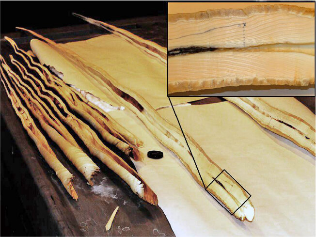

```{r setup, echo=FALSE, eval=TRUE}
knitr::opts_chunk$set(echo = FALSE, eval = TRUE,
                      comment = NA, warning = FALSE,
                      message = FALSE)
knitr::opts_chunk$set(fig.width = 6, fig.height = 3, fig.align = "center")
```

```{r}
library(ggplot2)
library(kableExtra)
library(latex2exp)
library(mvtnorm)
library(patchwork)
library(reshape2)
library(splines)

theme_set(theme_light(base_size = 9))
```

# Contexte

\qquad Le narval est une espèce de cétacés vivant dans ocean Arctique, autour du Groenland.
Le narval peut atteindre 5 mètres de long et un poids de 1600 kilogrammes et possède une longue durée de vie de 50 ans en moyenne.
Il est surnommé licorne des mers en raison de sa dent ressemblant à une corne pouvant mesurer jusqu'à 3 mètres de long.

\qquad Dans le cadre du projet tutoré de notre 2\textsuperscript{ème} de Master Statistique et Science des Données nous nous sommes intéressés à deux questions impliquant cet animal :

* l'impact des perturbations humaines sur le comportement des narvals,
* l'estimation de la durée de vie des narvals à partir des sillons de leur dent.

\qquad Ce travail s'inscrit dans une collaboration du Laboratoire Jean Kuntzmann (LJK) de Grenoble avec l'Université de Copenhague et l'Institut groenlandais des ressources naturelles.
Nous tenons à fortement remercier notre tutrice de projet, Madame Adeline Leclercq Samson, chercheuse au LJK et grandement impliquée dans cette collaboration, de nous avoir accompagnés et guidés tout au long du projet, mais aussi d'avoir fait en sorte qu'il nous soit le plus intéressant possible en nous impliquant sur le choix de certains axes à investiguer.

# Effet des perturbations humaines sur l'alimentation des narvals

```{r}
set.seed(15)

source("../R/1_buzzing/utils/biexp.R")
source("../R/1_buzzing/utils/monte_carlo_conf_int.R")
```

\qquad Les narvals sont des baleines vivant toute l'année au Groenland.
Le réchauffement climatique favorise le recul des glaces sur le territoire groenlandais et ses côtes.
Cela ouvre la porte au développement d'activités humaines au Groenland, et notamment des activités minières.
Les biologistes de l'Institut groenlandais des ressources naturelles se questionnent sur les effets potentiels engendrés par la présence humaine sur les comportements des narvals.

\qquad Afin d'anticiper ces possibles modifications de comportements une étude a été conduite pendant plusieurs mois en 2018 [@buzzing].
Dans ce cadre, 6 narvals ont été équipées de capteurs permettant d'enregistrer leur profondeur de plongée, leur localisation et les sons qu'elles émettent.
Les baleines ont été laissées libres de toutes perturbations pendant plusieurs jours avant d'y être exposées.
Les perturbations ont pris la forme de coups de fusil tirés dans l'eau depuis un bateau afin d'imiter les ondes émises par des activités minières.

\qquad Lorsqu'elles se nourissent, les narvals émettent des sons spécifiques appelés \say{buzz}.
À partir des sons collectés il est donc possible de déterminer quand ces baleines sont en train de manger.
La distance séparant les baleines du bateau émettant une perturbation peut être calculée grâce aux puces GPS placées sur les narvals.
Ainsi, nous pouvons modéliser l'effet de l'exposition des perturbations humaines sur l'émission de buzz des narvals et donc indirectement sur leur alimentation.

## Modélisation de l'effet de l'exposition sur le taux d'émission

### Processus de Poisson

\qquad Les données sont collectées toutes les secondes, ainsi nous disposons des temps de collecte $T_j$ et $T_{j+1} = T_j + \Delta$ avec $T_0 = 0$ et $\Delta = 1\ \text{seconde}$.
On peut considérer $N(t)$, le nombre de buzz émis entre le début de la collecte et un instant $t$, comme un processus stochastique pour lequel $N(0) = 0$ et donnant $N(b) - N(a)$ le nombre de buzz émis dans l'intervalle $]a, b]$. \newline
Les processus de comptage sont classiquement représentés par un processus de Poisson dont les accroissements sont indépendants et suivent une loi de Poisson : $N(t + \Delta) - N(t) \sim Pois$.
Dans le cas où l'intensité $\lambda$ du processus dépend de $t$, on parle de processus non-homogène et :
$$N(t + \Delta) - N(t) \sim Pois(\int_t^{t + \Delta} \lambda(u)du)$$
On a donc que :
$$\mathbb{P}(N(t + \Delta) - N(t) = k) = e^{-\int_t^{t + \Delta} \lambda(u)du} \frac{(\int_t^{t + \Delta} \lambda(u)du)^k}{k!}$$
En utilisant le développement limité de l'exponentielle et en considérant $\lambda(t)$ constante sur $]t, t + \Delta]$ on obtient :
\begin{align*}
    \mathbb{P}(N(t + \Delta) - N(t) = 0) &= 1 - \lambda(t) \Delta + o(\Delta) \\
    \mathbb{P}(N(t + \Delta) - N(t) = 1) &= \lambda(t) \Delta + o(\Delta) \\
    \mathbb{P}(N(t + \Delta) - N(t) \geq 2) &= o(\Delta)
\end{align*}
Ainsi, si $\Delta$ est suffisamment petit (de l'ordre de la seconde par exemple), $o(\Delta)$ est négligeable et le processus $Y(t) \vcentcolon = N(t + \Delta) - N(t)$ prend uniquement comme valeurs $0$ ou $1$.
On peut alors ramener notre processus de comptage à un processus de Bernoulli : $Y(t) \sim \mathcal{B}(\lambda(t) \Delta)$, ce qui implique :
$$\mathbb{E}(Y(t)) = \mathbb{P}(Y(t) = 1) = \lambda(t) \Delta \underset{\Delta = 1}{=} \lambda(t)$$

### Modèle linéaire généralisé

\qquad Nous cherchons à estimer le lien entre l'intensité d'émission de buzz et plusieurs covariables, dont le niveau d'exposition aux perturbations.
Nous avons vu dans la section précédente que les variables aléatoires $Y(t)$ de notre processus de comptage sont à valeurs dans ${0, 1}$ et que $\mathbb{P}(Y(t) = 1) = \lambda(t)$.
En se plaçant dans le cadre des modèles linéaires généralisés (GLM) il est donc possible d'exprimer la probabilité $\lambda(t)$ que $Y(t) = 1$ selon un vecteur de covariables $Z(t)$ (détaillées dans la suite de cette section) en utilisant le logarithme comme fonction de lien :
$$log(\lambda(t)) = \beta_0 + Z(t)^T \beta_Z$$
avec $\beta_Z$ le vecteur de paramètres associés au vecteur $Z(t)$.

#### Effet de la profondeur

\qquad Pour se nourrir, les narvals doivent plonger profondément (plusieurs centaines de mètres), alors que le reste du temps elles restent \say{proches} (quelques dizaines de mètres) de la surface.
Il faut donc inclure au modèle la covariable de profondeur à laquelle se trouvent les baleines quand elles émettent ou non des buzz.
La relation entre l'émission de buzz et la profondeur n'étant pas linéaire, la profondeur a été remplacée par une spline cubique naturelle ayant pour noeuds les quantiles $1/3$ et $2/3$.

#### Effet de l'exposition

\qquad Le niveau d'exposition aux perturbations est représenté par l'inverse de la distance séparant la baleine du bateau quand un coup de feu est tiré.
De même que pour la profondeur, la non-linéarité de la relation entre le niveau d'exposition et le taux d'émission de buzz est représentée par l'utilisation d'une spline cubique naturelle dont les noeuds sont les quantiles $1/3$ et $2/3$ des niveaux d'exposition.

### Non-indépendance des observations

\qquad L'utilisation d'un processus de Poisson pour modéliser nos données de comptage implique l'indépendance des observations $Y(t)$.
En pratique ce n'est pas le cas, aussi il faut modifier le modèle défini précédemment pour tenter de compenser cette absence d'indépendance.

#### Utilisation de modèles mixtes

\qquad Les données que nous utilisons correspondent à plusieurs individus, nous avons donc plusieurs observations par individu et celles-ci ne sont pas indépendantes.
Pour palier ce défaut de modélisation et tenir compte de la spécificité des individus, nous utilisons des modèles mixtes en ajoutant un effet aléatoire $b_i$ sur l'ordonnée à l'origine :
$$log(\lambda_i(t)) = \beta_0 + \textcolor{blue}{b_i} + spline(D_i(t)) \beta_{D_{1:3}} + spline(E_i(t)) \beta_{E_{1:3}}$$
où $i$ dénote l'individu $i$ et $b_i \sim \mathcal{N}(0, \sigma^2)$ l'effet aléatoire sur cet l'individu, $\sigma^2$ étant la variance inter-individuelle.

#### Caractère autorégressif du processus

\qquad De plus, l'émission d'un buzz à un instant $t$ est corrélé à l'émission ou non de buzz aux instants précédents ; cet effet mémoire doit donc être intégré au modèle pour tenir compte de la dépendance des $Y_{i}(t)$.
Pour cela nous introduisons $K$ variables binaires d'autorégression codant l'émission d'un buzz aux l'instants $t - k,\ k \in \{1, ..., K\}$.
Le modèle résultant s'écrit alors :
$$log(\lambda_i(t)) = \beta_0 + b_i + spline(D_i(t)) \beta_{D_{1:3}} + \textcolor{blue}{\sum_{k=1}^K \alpha_k Y_i(t-k)} + spline(E_i(t)) \beta_{E_{1:3}}$$
Cette approche demande de fixer une mémoire maximale, et ainsi la valeur de $K$.
Pour choisir la mémoire maximale optimale, nous avons fait varier $K$ et utilisé le BIC comme mesure de la qualité des différents modèles correspondants sans inclure l'effet de l'exposition :
\begin{equation}
log(\lambda_i(t)) = \beta_{D_0} + b_i + spline(D_i(t)) \beta_{D_{1:3}} + \sum_{k=1}^K \alpha_k Y_i(t-k) (\#eq:m-ard)
\end{equation}
Nous choisissons la mémoire maximale $K_{opt}$ du modèle minimisant ce critère.
Pour éviter de parcourir tout l'ensemble $\{K_{min}, ..., K_{max}\}$, nous avons utilisé la démarche proposée par l'Algorithme \@ref(alg:opt) permettant de restreindre l'ensemble de recherche au fur et à mesure que l'on s'approche de $K_{opt}$.

\begin{algorithm}
\caption{Réduction progressive de l'ensemble de recherche de $K_{opt}$.}
\label{alg:opt}
\begin{algorithmic}
\State $from_k \gets K_{min};\ to_k \gets K_{max}$ \Comment{Bornes de l'intervalle de recherche}
\State $M \gets 10$ \Comment{Nombre d'éléments évalués dans l'intervalle}
\While{$(to_k - from_k > 2)$} \Comment{On s'arrête quand on évalué l'ensemble du voisinage du minimum}
    \State $K_{1:M} \gets NA$
    \State $BIC_{1:M} \gets NA$
    \For{$i \in \{1, ..., M\}$}
        \State $K_i \gets from_k + (i - 1) * \lfloor\frac{to_k - from_k}{M - 1}\rceil$ \Comment{Découpage en $M$ éléments équidistants}
        \State $\mathcal{M} \gets$ ajustement du modèle de l'Equation \eqref{eq:m-ard} avec $K_i$ éléments mémoire
        \State $BIC_i \gets$ calcul du BIC de $\mathcal{M}$
    \EndFor
    \State $i_{opt} \gets argmin\ BIC$
    \State $K_{opt} \gets K_{i_{opt}}$
    \State $from_k \gets K_{i_{opt} - 1};\ to_k \gets K_{i_{opt} + 1}$ \Comment{Mise à jour des bornes en encadrant le minimum}
\EndWhile
\end{algorithmic}
\end{algorithm}

\qquad Le nombre de composants autorégressifs pouvant être grand, il faut les lier aux $\alpha_k$ avec un modèle de régression.
Pour cela, nous avons utilisé une régression double bi-exponentielle :
$$BiExp(lag) = A_1 e^{-e^{lrc_1} lag} + A_2 e^{-e^{lrc_2} lag}$$
Cela permet de réduire le nombre de coefficients de $K_{opt}$ à $4$, ce qui est doublement bénéfique : le temps d'ajustement des modèles est grandement réduit et lors de la construction des intervalles de confiance de nos coefficients, l'accumulation des variances est limitée.

\qquad Le modèle complet s'exprime donc ainsi :
$$log(\lambda_i(t)) = \beta_0 + b_i + spline(D_i(t)) \beta_{D_{1:3}} + \sum_{k=1}^{K_{opt}} \textcolor{blue}{(A_1 e^{-e^{lrc_1} k} + A_2 e^{-e^{lrc_2} k})} Y_i(t-k) + spline(E_i(t)) \beta_{E_{1:3}}$$

### Effet de médiation de la profondeur

\qquad Il est possible que l'exposition à des perturbations conduisent les narvals à :

1. émettre moins de buzz,
2. moins plonger ou plonger moins profondément.

Mais il existe également un lien entre la profondeur d'immersion des baleines et leur production de buzz.
Aussi, il se peut que l'exposition ait un lien direct sur l'émission de buzz et un lien indirect via son effet sur la profondeur.

\qquad Afin de représenter uniquement le lien direct, les coefficients des covariables autres que l'exposition sont estimés sans inclure celle-ci à partir des observations effectuées sans soumettre les animaux à des perturbations :
\begin{equation}
log(\lambda_i(t)) = \beta_{D_0} + b_i + spline(D_i(t)) \beta_{D_{1:3}} + \sum_{k=1}^{K_{opt}} A_1 e^{-e^{lrc_1} k} + A_2 e^{-e^{lrc_2} k} Y_i(t-k) (\#eq:m0)
\end{equation}
Nous obtenons donc les estimations $\widehat{\beta_{D}},\ \widehat{A_{1:2}},\ \widehat{lrc_{1:2}}$ qui sont ensuite injectées dans le modèle complet au moyen d'un terme d'\say{offset} (non réestimé) :
\begin{equation}
offset_i(t) = \widehat{\beta_{D_0}} + spline(D_i(t)) \widehat{\beta_{D_{1:3}}} + \sum_{k=1}^{K_{opt}} (\widehat{A_1} e^{-e^{\widehat{lrc_1}} k} + \widehat{A_2} e^{-e^{\widehat{lrc_2}} k}) Y_i(t-k) (\#eq:offset)
\end{equation}
Le modèle incluant l'exposition est donc reformulé ainsi :
\begin{equation}
log(\lambda_i(t)) = \beta_{E_0} + b_i + \textcolor{blue}{offset_i(t)} + spline(E_i(t)) \beta_{E_{1:3}} (\#eq:m)
\end{equation}
Et les paramètres estimés $\widehat{\beta_{E}}$ permettront d'évaluer l'effet de l'exposition par rapport à des conditions \say{normales}.

### Intervalles de confiance

#### Construction par approche Monte-Carlo

\qquad Après avoir estimé les coefficients associés à l'exposition aux perturbations, nous souhaitons construire les intervalles de confiance de ces estimations.
L'approche classique de calcul des intervalles de confiance se basant sur la seule variance estimée des coefficients d'exposition donnerait ici des résultats incorrects, la variance des coefficients de profondeur et d'autorégression ne serait alors pas prise en compte car tuée par l'utilisation de l'offset.

##### Utilisation de lois normales univariées {#mc-norm}

Dans un premier temps, nous avons donc ajusté le modèle sans exposition décrit par l'Equation \@ref(eq:m0) afin d'obtenir la moyenne et la variance empiriques de ses coefficients.
Nous avons ensuite répété le tirage des coefficients sans exposition selon 8 lois normales univariées paramétrées par leurs statistiques empiriques ; calculé le terme d'offset selon l'Equation \@ref(eq:offset) à partir des réalisations obtenues ; et estimé les coefficients d'exposition $\widehat{\beta_{E}^k}$ du modèle correspondant à l'Equation \@ref(eq:m).
Les coefficients $\widehat{\beta_{E}^k}$ estimés à chaque itération constituent ainsi un échantillon dont nous utilisons les quantiles empiriques $\alpha / 2$ et $1 - \alpha / 2$ comme bornes de l'intervalle de confiance au niveau $\alpha$ de chacun des coefficients d'exposition.

##### Utilisation de lois normales multivariées {#mc-mvnorm}

Le tirage selon des lois normales univariées implique que nous ne considérons pas la covariance existant entre les estimations des coefficients $\widehat{\beta_{D}}$, $\widehat{A_{1:2}}$ et $\widehat{lrc_{1:2}}$.
Afin d'y remédier nous avons employé un tirage suivant 2 lois normales multivariées de dimension 4 (une pour les coefficients $\widehat{\beta_{D}}$ et une pour $\widehat{A_{1:2}}$ et $\widehat{lrc_{1:2}}$, dont le vecteur de moyenne est toujours constitué des moyennes empiriques des coefficients sans exposition, mais dont les matrices de variance-covariance ne sont pas diagonales.

##### Variance-covariance des coefficients autorégressifs {#mc-ar}

La matrice de variance-covariance permettant de tirer les coefficients $\widehat{A_{1:2}}$ et $\widehat{lrc_{1:2}}$ était construite à partir des estimations de la régression double bi-exponentielle, ce qui signifie que nous ne captons pas directement la variabilité du phénomène autorégressif mais plutôt celle de la régression double bi-exponentielle. Pour palier cette approximation, nous avons recalculé la matrice de variance-covariance des coefficients $\widehat{A_{1:2}}$ et $\widehat{lrc_{1:2}}$ par une autre procédure Monte-Carlo en répétant l'ajustement de la régression double bi-exponentielle pour des coefficients mémoire tirés selon une loi normale multivariée. Cette approche est décrite par l'Algorithme \@ref(alg:mc).

\begin{algorithm}
\caption{Procédure Monte-Carlo d'obtention des intervalles de confiance.}
\label{alg:mc}
\begin{algorithmic}
\State $\mathcal{M}_0 \gets$ ajustement du modèle correspondant à l'Equation \eqref{eq:m-ard}
\State $\mu_D,\ \Sigma_D,\ \mu_{AR},\ \Sigma_{AR} \gets$ estimation à partir de $\mathcal{M}_0$

\State $K \gets 1000$ \Comment{Nombre de répétitions des procédures}

\Comment{1ère procédure}
\State $\widehat{\beta_{A_{1:2}}}^{(1:K)} \gets NA$
\State $\widehat{\beta_{lrc_{1:2}}}^{(1:K)} \gets NA$
\For{$k \in \{1, ..., K\}$}
    \State $\hat{\alpha} \gets \mathcal{N}(\mu_{AR},\ \Sigma_{AR})$ \Comment{Tirage des coefficients autorégressifs}
    \State $\mathcal{M}_{exp} \gets$ ajustement de la régression double bi-exponentielle utilisant $\hat{\alpha}$
    \State $\widehat{\beta_{A_{1:2}}}^{(k)},\ \widehat{\beta_{lrc_{1:2}}}^{(k)} \gets$ coefficients de $\mathcal{M}_{exp}$
\EndFor
\State $\mu_{exp},\ \Sigma_{exp} \gets$ calculés à partir de $\widehat{\beta_{A_{1:2}}},\ \widehat{\beta_{lrc_{1:2}}}$

\Comment{2ème procédure}
\State $\widehat{\beta_{E}}^{(1:K)} \gets NA$
\For{$k \in \{1, ..., K\}$}
    \State $\widehat{\beta_{D}} \gets \mathcal{N}(\mu_D,\ \Sigma_D)$ \Comment{Tirage des coefficients de profondeur}
    \State $\widehat{A_{1:2}},\ \widehat{lrc_{1:2}} \gets \mathcal{N}(\mu_{exp},\ \Sigma_{exp})$ \Comment{Tirage des coefficients de la double bi-exponentielle}
    \State calcul de l'offset selon l'Equation \eqref{eq:offset} avec $\widehat{\beta_{D}},\ \widehat{A_{1:2}},\ \widehat{lrc_{1:2}}$
    \State $\mathcal{M} \gets$ ajustement du modèle donné par l'Equation \eqref{eq:m} en fixant l'offset
    \State $\widehat{\beta_{E}}^{(k)} \gets$ coefficients de profondeur de $\mathcal{M}$
\EndFor
\State $IC_\alpha \gets [q_{\alpha / 2}^{\widehat{\beta_{E}}}, q_{1 - \alpha / 2}^{\widehat{\beta_{E}}}]$ \Comment{Estimation via les quantiles empiriques}
\end{algorithmic}
\end{algorithm}

##### Sans passer par la régression double bi-exponentielle {#mc-nexp}

L'intérêt de l'utilisation de la régression double bi-exponentielle est de :

1. réduire le temps d'ajustement des modèles linéaires,
2. éviter d'accumuler les variances des 60 coefficients de mémoire.

En fixant les coefficients autorégressifs, avoir 4 ou 60 coefficients pour la mémoire n'importe plus ; et en utilisant une loi normale multivariée, nous devrions également ne plus accumuler directement les variances des coefficients.
Nous pouvons donc envisager de nous passer de la régression double bi-exponentielle, et de tirer les 60 coefficients mémoire et les 4 coefficients de profondeur directement dans une seule loi normale multivariée dont les paramètres sont obtenus après ajustement du modèle sans exposition de l'Equation \@ref(eq:m-ard).
Ainsi nous revenons à une seule procédure Monte-Carlo (la deuxième dans l'Algorithme \@ref(alg:mc)) et l'offset utilisé dans l'Equation \@ref(eq:m) du modèle complet devient :
$$
offset_i(t) = \widehat{\beta_{D_0}} + spline(D_i(t)) \widehat{\beta_{D_{1:3}}} + \sum_{k=1}^{K_{opt}} \widehat{\alpha_k} Y_i(t-k)
$$

#### Estimation de bandes de prédiction via la méthode Delta {#delta}

\qquad Une fois les coefficients d'exposition $\widehat{\beta_E}$ estimés nous pouvons prédire le taux d'émission de buzz sur l'ensemble d'un intervalle de niveau d'exposition aux perturbations.
Afin d'associer une bande de confiance à la prédiction moyenne nous avons appliqué la méthode Delta pour calculer la variance du taux d'émission.

Tout d'abord, d'après le Théorème Central Limite on a : $\sqrt{n} (\widehat{\beta} - \beta) \sim \mathcal{N}(0, \Sigma)$ avec $\widehat{\beta}$ les coefficients estimés du modèle et $\Sigma$ leur variance.

Etant donné que nous utilisons un GLM avec un lien log, le taux d'émission est lié aux coefficients du modèle via la relation $\lambda(t) = exp(X(t) \beta) \vcentcolon = f(\beta)$.
Le gradient de la fonction $f$ vaut $\nabla f(\beta) = X f(\beta)$.

Ainsi, quand on applique la méthode Delta on obtient :
\begin{align*}
    \sqrt{n} (f(\widehat{\beta}) - f(\beta)) &\xrightarrow[]{\mathcal{L}} \mathcal{N}(0, \nabla f(\beta)^T \Sigma \nabla f(\beta)) \\
    \Leftrightarrow \sqrt{n} (\widehat{\lambda(t)}) - \lambda(t)) &\xrightarrow[]{\mathcal{L}} \mathcal{N}(0, \lambda(t)^2 X(t)^T \Sigma X(t))
\end{align*}
donc
$$
\frac{\sqrt{n}}{\widehat{\lambda(t)} \sqrt{X(t)^T \widehat{\Sigma} X(t)}} (\widehat{\lambda(t)}) - \lambda(t)) \rightsquigarrow \mathcal{N}(0, 1)
$$
On en déduit la bande de confiance au niveau $\alpha$ :
$$
IC_\alpha(\lambda(t)) = [\widehat{\lambda(t)} \pm q_{1 - \alpha / 2}^\mathcal{N} \frac{\widehat{\lambda(t)} \sqrt{X(t)^T \widehat{\Sigma} X(t)}}{\sqrt{n}}]
$$
où $q_{1 - \alpha / 2}^\mathcal{N}$ est le quantile $1 - \alpha / 2$ de la loi normale centrée réduite.

## Résultats

### Note sur le temps d'ajustement des modèles

```{r}
glm.profiling <- as.data.frame(readRDS("../data/1_buzzing/glm_buzz_depth_maxlag_profiling/profiling.rds"))
glm.profiling$maxlag <- as.numeric(rownames(glm.profiling))

glmer.profiling <- as.data.frame(readRDS("../data/1_buzzing/glmer_buzz_depth_maxlag_profiling/profiling.rds"))
glmer.profiling$maxlag <- as.numeric(rownames(glmer.profiling))
```

\qquad Le temps d'ajustement des modèles, et en particulier des modèles mixtes, augmente fortement lorsque que le nombre de paramètres à ajuster augmente. \newline
Comme nous pouvons le voir sur la Figure \@ref(fig:glm-time) cette augmentation est linéaire pour les modèles classiques, alors que pour les modèles mixtes celle-ci est quadratique.

```{r glm-time, fig.width = 8, fig.cap = "Courbes pleines : temps d'ajustement (en secondes) des modèles en fonction de la mémoire maximum ; courbes en pointillés : $f(x) = x$ à gauche et $f(x) = x^{2.5}$ à droite."}
g1 <- ggplot(glm.profiling, aes(x = maxlag, y = total_time, group = 1)) +
  geom_line() +
  geom_point() +
  geom_function(fun = function(x) { x }, linetype = "dashed") +
  labs(x = "Composants mémoire",
       y = "Temps d'ajustement [secondes]",
       caption = "Modèles classiques") +
  theme(plot.margin = margin(0, 0, 0, 0, "pt"))

g2 <- ggplot(glmer.profiling, aes(x = maxlag, y = total_time, group = 1)) +
  geom_line() +
  geom_point() +
  geom_function(fun = function(x) { x^2.5 }, linetype = "dashed") +
  labs(x = "Composants mémoire",
       y = "Temps d'ajustement [secondes]",
       caption = "Modèles mixtes") +
  theme(axis.title.y = element_blank(),
        plot.margin = margin(0, 0, 0, 1, "pt"))

g1 + g2
```

### Recherche de la mémoire optimale

```{r}
maxlag.bic <- readRDS("../data/1_buzzing/glm_buzz_depth_maxlag/maxlag.bic.rds")
maxlag.opt <- as.integer(maxlag.bic[which.min(maxlag.bic[, 2]), 1])
maxlag.glmer.bic <- readRDS("../data/1_buzzing/glmer_buzz_depth_maxlag/maxlag.bic.rds")
maxlag.glmer.opt <- as.integer(maxlag.glmer.bic[which.min(maxlag.glmer.bic[, 2]), 1])
```

\qquad Le temps d'ajustement des modèles mixtes étant nettement plus important que ceux des modèles sans effets aléatoires, nous avons dans un premier temps exclu ces effets du modèle sans exposition pour estimer la mémoire optimale.
Nous avons choisi pour la recherche $K_{min} = 1,\ K_{max} = 300,\ M = 10$.
Nous obtenons une mémoire optimale de `r maxlag.opt` secondes.
Cela nous a permis de restreindre tout de suite l'ensemble de recherche initial à $K_{min} = 1,\ K_{max} = 300$ quand nous avons considéré le modèle incluant les effets aléatoires.
De même que précédemment, la mémoire optimale est égale à `r maxlag.glmer.opt` secondes.
La Figure \@ref(fig:maxlag-bic) permet de voir que dans les deux cas les optimums semblent bien correspondre à des minimums globaux.

```{r maxlag-bic, fig.width = 8, fig.cap = "BIC en fonction de la mémoire maximum."}
g1 <- ggplot(maxlag.bic, aes(x = maxlag, y = BIC)) +
  geom_line() +
  geom_point() +
  geom_vline(xintercept = maxlag.opt, col = "blue", lty = 2) +
  labs(x = "Mémoire maximum [secondes]", caption = "Modèles classiques")
g2 <- ggplot(maxlag.glmer.bic, aes(x = maxlag, y = BIC)) +
  geom_line() +
  geom_point() +
  geom_vline(xintercept = maxlag.glmer.opt, col = "blue", lty = 2) +
  labs(x = "Mémoire maximum [secondes]", caption = "Modèles mixtes")

g1 + g2
```

### Régression double bi-exponentielle sur les coefficients autorégressifs

\qquad La Figure \@ref(fig:biexp-AR) permet de comparer la régression double bi-exponentielle et les composantes de la mémoire ajustées pour un décalage maximum de `r maxlag.opt`.
Nous pouvons constater que l'ajustement par la double bi-exponentielle est très fidèle aux `r maxlag.opt` coefficients initiaux.

```{r}
ARcoefs.fit <- readRDS("../data/1_buzzing/glmer_buzz_depth_maxlag/ARcoef.fit.rds")
```

```{r biexp-AR, fig.width = 5, fig.height = 2.5, fig.cap = "Régression double bi-exponentielle des coefficients autorégressifs."}
ggplot(ARcoefs.fit, aes(x = lag, y = truth)) +
  geom_point(alpha = 0.5) +
  geom_line(aes(x = lag, y = estimate)) +
  geom_hline(yintercept = 0, alpha = .5, lty = 2) +
  labs(x = "Mémoire [secondes]", y = "Coefficient")
```

Les 4 coefficients obtenus suite à la régression double bi-exponentielle sont présentés dans la Table \@ref(tab:coef-biexp-AR).
Nous pouvons noter que leurs erreurs standard sont faibles, ce qui est cohérent avec la validation visuelle de la régression.

```{r}
RegBiExp.coefs <- readRDS("../data/1_buzzing/glmer_buzz_depth_maxlag/ARcoef.RegBiExp.rds")
```

```{r coef-biexp-AR}
df <- data.frame(RegBiExp.coefs[, c("estimate", "std.error")])
row.names(df) <- c("$A_1$", "$lrc_1$", "$A_2$", "$lrc_2$")
kable(df,
      col.names = c("moyenne", "erreur standard"),
      caption = "Coefficients autorégressifs obtenus par régression double bi-exponentielle",
      label = "coef-biexp-AR",
      digits = 3,
      escape = FALSE) %>%
  kable_styling(latex_options = "HOLD_position")
```

### Impact de l'exposition aux perturbations sur le taux d'émission de buzz

\qquad La Table \@ref(tab:coef-glmer-expo) expose les coefficients associés à l'exposition du modèle mixte.
Interpréter les valeurs des coefficients liés à des splines étant peu pertinent, nous préférons nous référer à la lecture de la Figure \@ref(fig:mod-expo-rate) sur laquelle nous représentons les estimations du modèle pour le taux d'émission de buzz selon la distance avec le bateau.
Il apparaît alors clairement que plus le bateau est loin, plus le taux d'émission de buzz est élevé.

```{r}
predFrame <- readRDS("../data/1_buzzing/glmer_buzz_ARDepth_expo_pred/predFrame.rds")
predFramePop <- readRDS("../data/1_buzzing/glmer_buzz_ARDepth_expo_pred/predFramePop.rds")
```

```{r mod-expo-rate, fig.cap = "Evolution du taux d'émission de buzz selon la distance au bateau."}
ggplot(data = predFrame, aes(x = 1 / X, y = 60 * exp(predBuzz), color = Ind)) +
  geom_line() +
  geom_line(data = predFramePop, aes(x = 1 / X, y = 60 * exp(predBuzzPop)), size = 1.2, color = "black") +
  xlim(0, 50) +
  xlab("Distance avec le bateau [km]") +
  ylab("Taux d'émission de buzz [1/min]") +
  scale_color_discrete(name = "Baleine")
```

```{r}
glmerAllBuzzDepth.tidy <- readRDS("../data/1_buzzing/glmer_buzz_ARDepth_expo/glmerAllBuzzDepth.tidy.rds")
glmerAllBuzzDepth.glance <- readRDS("../data/1_buzzing/glmer_buzz_ARDepth_expo/glmerAllBuzzDepth.glance.rds")
acf.plot.data <- readRDS("../data/1_buzzing/glmer_buzz_ARDepth_expo/acf.plot.data.rds")
QQ.plot.data <- readRDS("../data/1_buzzing/glmer_buzz_ARDepth_expo/QQ.plot.data.rds")
z.plot.data <- readRDS("../data/1_buzzing/glmer_buzz_ARDepth_expo/z.plot.data.rds")
```

```{r coef-glmer-expo}
df <- data.frame(glmerAllBuzzDepth.tidy[2:4, c("estimate", "std.error")])
row.names(df) <- c("$\\beta_{E_1}$", "$\\beta_{E_2}$", "$\\beta_{E_3}$")
kable(df,
      col.names = c("moyenne", "erreur standard"),
      caption = "Coefficients d'exposition.",
      label = "coef-glmer-expo",
      digits = 3,
      escape = FALSE) %>%
  kable_styling(latex_options = c("HOLD_position"))
```

\qquad Nous voulons vérifier que notre processus de comptage est bien représenté par un processus de Poisson et que nous avons bien tenu compte de la corrélation entre ses accroissements.
Pour cela, nous nous sommes intéressé aux résidus uniformes du modèle.

Pour vérifier l'absence de corrélation, nous avons représenté sur la Figure \@ref(fig:mod-expo-val) l'autocorrélation des résidus en fonction du décalage temporel, ainsi que les résidus en fonction des résidus précédents.
Nous remarquons qu'aucun motif de corrélation ne semble apparaître, ce qui vient valider notre approche pour inclure au modèle le lien naturel existant entre les émissions de buzz.

Le Q-Q plot de la Figure \@ref(fig:mod-expo-val) confirme lui que le processus de Poisson est bien adapté aux données de comptage des buzz étant donné que les quantiles des résidus correspondent à ceux de la loi uniforme.

```{r mod-expo-val, fig.height = 5, fig.cap = "Validation graphique du modèle."}
g1 <- ggplot(data = acf.plot.data, aes(x = lag, y = acf)) +
  geom_col(size = .2) +
  labs(x = "Décalage", y = "Autocorrélation",
       caption = "Autocorrélation des résidus") +
  theme(plot.margin = margin(0, 0, 1, 0, "pt"))

g2 <- ggplot(data = z.plot.data[2:nrow(z.plot.data),], aes(x = Zlow, y = Zupp)) +
  geom_point(size = .25) +
  labs(x = TeX("$Z_{i+1}$"), y = TeX("$Z_{i}$"),
       caption = "Résidu selon le précédent") +
  coord_fixed() +
  theme(plot.margin = margin(0, 1, 0, 0, "pt"))

g3 <- ggplot(QQ.plot.data, aes(x = qunif, y = qZ)) +
  geom_point(size = .5) +
  geom_abline(slope = 1, intercept = 0, size = 1, linetype = "dashed") +
  labs(x = "Quantiles uniformes théoriques ", y = "Quantiles empiriques",
       caption = "Q-Q plot") +
  coord_fixed() +
  theme(plot.margin = margin(0, 0, 0, 0, "pt"))

g1 / (g2 + g3)
```

### Intervalles de confiance

#### Coefficients d'exposition

##### Utilisation de lois normales univariées

Comme détaillé dans la section \@ref(mc-norm), nous avons commencé par considérer que les coefficients autorégressifs et de profondeur suivaient chacun une loi normale centrée sur leur estimation moyenne et avec une variance égale au carré de leur erreur standard.
Nous avons donc 4 lois normales univariées pour les coefficients de la régression double bi-exponentielle et 4 autres pour la spline sur la profondeur.

```{r}
glmer.coefs <- readRDS("../data/1_buzzing/glmer_buzz_depth_maxlag/ARcoef.best.rds")
```

```{r}
B <- 1000
A1 <- rnorm(B, RegBiExp.coefs$estimate[1], RegBiExp.coefs$std.error[1])
lrc1 <- rnorm(B, RegBiExp.coefs$estimate[2], RegBiExp.coefs$std.error[2])
A2 <- rnorm(B, RegBiExp.coefs$estimate[3], RegBiExp.coefs$std.error[3])
lrc2 <- rnorm(B, RegBiExp.coefs$estimate[4], RegBiExp.coefs$std.error[4])
ARcoefs.fit.mc <- do.call(rbind, lapply(1:B, function(b) {
  estimate <- BiExp(A1[[b]], lrc1[[b]], A2[[b]], lrc2[[b]], lag = ARcoefs.fit$lag)
  data.frame(lag = ARcoefs.fit$lag, estimate = estimate, b = as.factor(b))
}))

estimate <- as.matrix(ns(-1000:0, knots = c(-323, -158, -54))) %*%
  glmer.coefs$estimate[2:5]
Depthcoefs.fit <- data.frame(depth = -1000:0, estimate = estimate)
d1 <- rnorm(B, glmer.coefs$estimate[2], glmer.coefs$std.error[2])
d2 <- rnorm(B, glmer.coefs$estimate[3], glmer.coefs$std.error[3])
d3 <- rnorm(B, glmer.coefs$estimate[4], glmer.coefs$std.error[4])
d4 <- rnorm(B, glmer.coefs$estimate[5], glmer.coefs$std.error[5])
Depthcoefs.fit.mc <- do.call(rbind, lapply(1:B, function(b) {
  estimate <- as.matrix(ns(-1000:0, knots = c(-323, -158, -54))) %*%
    c(d1[[b]], d2[[b]], d3[[b]], d4[[b]])
  data.frame(depth = -1000:0, estimate = estimate, b = as.factor(b))
}))
```

Sur la Figure \@ref(fig:coef-ar-norm) nous avons représenté les courbes des fonctions double bi-exponentielles ainsi générées.
Nous pouvons voir que leurs allures semblent toujours suivre celle de la régression initiale.

```{r coef-ar-norm, fig.cap = "Variation des coefficients autorégressif selon des lois normales univariées."}
ggplot(ARcoefs.fit, aes(x = lag, y = truth)) +
  geom_line(data = ARcoefs.fit.mc, aes(x = lag, y = estimate, group = b), alpha = .1, col = "red") +
  geom_point(alpha = 0.5) +
  geom_line(aes(x = lag, y = estimate)) +
  geom_hline(yintercept = 0, alpha = .5, lty = 2) +
  labs(x = "Mémoire [secondes]", y = "Coefficient")
```

Nous avons fait de même avec les coefficients de profondeur, et nous pouvons remarquer sur la Figure \@ref(fig:coef-depth-norm) que cette fois-ci certaines courbes s'éloignent sensiblement de l'interpolation moyenne.

```{r coef-depth-norm, fig.cap = "Variation des coefficients de profondeur selon des lois normales univariées."}
ggplot(Depthcoefs.fit) +
  geom_line(data = Depthcoefs.fit.mc, aes(x = depth, y = estimate, group = b), alpha = .1, col = "red") +
  geom_line(aes(x = depth, y = estimate)) +
  geom_hline(yintercept = 0, alpha = .5, lty = 2) +
  labs(x = "Profondeur [mètres]", y = "ns")
```

```{r}
expo.coef <- readRDS("../data/1_buzzing/glmer_buzz_ARDepth_expo_par/expo.coef.norm.rds")

expo.coef.estimate <- expo.coef[, c("term", "estimate")]
expo.coef.estimate$seq <- with(expo.coef.estimate, ave(estimate, term, FUN = seq_along))
expo.coef.estimate <- t(dcast(expo.coef.estimate, seq ~ term, value.var = "estimate")[, 2:5])
expo.coef.estimate.confint <- t(apply(expo.coef.estimate, 1, mc_percentile))

alpha <- .05
expo.coef.std.error <- expo.coef
expo.coef.std.error$seq <- with(expo.coef.std.error, ave(std.error, term, FUN = seq_along))
expo.coef.std.error$lower <-
  expo.coef.std.error$estimate - qnorm(1 - alpha / 2) * expo.coef.std.error$std.error
expo.coef.std.error$upper <-
  expo.coef.std.error$estimate + qnorm(1 - alpha / 2) * expo.coef.std.error$std.error
expo.coef.std.error.lower <- apply(t(dcast(expo.coef.std.error, seq ~ term, value.var = "lower")[, 2:5]),
                                   1, median)
expo.coef.std.error.upper <- apply(t(dcast(expo.coef.std.error, seq ~ term, value.var = "upper")[, 2:5]),
                                   1, median)
expo.coef.std.error.confint <- cbind(expo.coef.std.error.lower, expo.coef.std.error.upper)
```

Les intervalles de confiance calculés avec la procédure Monte-Carlo sont donnés sur la Table \@ref(tab:coef-expo-ci-norm).
Nous avons également affiché les valeurs médianes des intervalles de confiance calculés à chaque répétition sur la base de la variation des coefficients d'exposition uniquement.
Il est flagrant que les intervalles Monte-Carlo sont bien plus larges et ne permettent en aucun cas de conclure sur un effet de l'exposition sur le taux d'émission de buzz.

```{r coef-expo-ci-norm}
df <- data.frame(cbind(expo.coef.estimate.confint, expo.coef.std.error.confint))
row.names(df) <- c("$\\beta_0$", "$\\beta_{E_1}$", "$\\beta_{E_2}$", "$\\beta_{E_3}$")
kable(df,
      col.names = c("inf", "sup", "inf", "sup"),
      caption = "Intervalles de confiance dans le cas de normales univariées.",
      label = "coef-expo-ci-norm",
      digits = 3,
      escape = FALSE) %>%
  kable_styling(latex_options = c("HOLD_position")) %>%
  add_header_above(c(" " = 1, "Monte-Carlo" = 2, "Erreur standard" = 2))
```

La Figure \@ref(fig:coef-expo-ci-norm-dist) donne une représentation graphique de ces intervalles (en rouge les "MC" et en bleu les "SE"), ainsi que des distributions des coefficients.

```{r coef-expo-ci-norm-dist, fig.height = 5, fig.cap = "Intervalles de confiance dans le cas de normales univariées."}
g1 <- ggplot() +
  geom_histogram(data = data.frame(coef = as.numeric(expo.coef.estimate[1,])),
                 aes(x = coef), position = "identity", col = "grey") +
  geom_vline(xintercept = expo.coef.estimate.confint[1, 1], lty = 2, col = "red") +
  geom_vline(xintercept = expo.coef.estimate.confint[1, 2], lty = 2, col = "red") +
  geom_vline(xintercept = expo.coef.std.error.confint[1, 1], lty = 2, col = "blue") +
  geom_vline(xintercept = expo.coef.std.error.confint[1, 2], lty = 2, col = "blue") +
  labs(x = TeX("Intercept $\\beta_{E_0}$"), y = "Effectif") +
  theme(plot.margin = margin(0, 1, 1, 0, "pt"))

g2 <- ggplot() +
  geom_histogram(data = data.frame(coef = as.numeric(expo.coef.estimate[2,])),
                 aes(x = coef), position = "identity", col = "grey") +
  geom_vline(xintercept = expo.coef.estimate.confint[2, 1], lty = 2, col = "red") +
  geom_vline(xintercept = expo.coef.estimate.confint[2, 2], lty = 2, col = "red") +
  geom_vline(xintercept = expo.coef.std.error.confint[2, 1], lty = 2, col = "blue") +
  geom_vline(xintercept = expo.coef.std.error.confint[2, 2], lty = 2, col = "blue") +
  labs(x = TeX("Exposition $\\beta_{E_1}$"), y = "Effectif") +
  theme(axis.title.y = element_blank(),
        plot.margin = margin(0, 0, 1, 0, "pt"))

g3 <- ggplot() +
  geom_histogram(data = data.frame(coef = as.numeric(expo.coef.estimate[3,])),
                 aes(x = coef), position = "identity", col = "grey") +
  geom_vline(xintercept = expo.coef.estimate.confint[3, 1], lty = 2, col = "red") +
  geom_vline(xintercept = expo.coef.estimate.confint[3, 2], lty = 2, col = "red") +
  geom_vline(xintercept = expo.coef.std.error.confint[3, 1], lty = 2, col = "blue") +
  geom_vline(xintercept = expo.coef.std.error.confint[3, 2], lty = 2, col = "blue") +
  labs(x = TeX("Exposition $\\beta_{E_2}$"), y = "Effectif") +
  theme(plot.margin = margin(0, 1, 0, 0, "pt"))

g4 <- ggplot() +
  geom_histogram(data = data.frame(coef = as.numeric(expo.coef.estimate[4,])),
                 aes(x = coef), position = "identity", col = "grey") +
  geom_vline(xintercept = expo.coef.estimate.confint[4, 1], lty = 2, col = "red") +
  geom_vline(xintercept = expo.coef.estimate.confint[4, 2], lty = 2, col = "red") +
  geom_vline(xintercept = expo.coef.std.error.confint[4, 1], lty = 2, col = "blue") +
  geom_vline(xintercept = expo.coef.std.error.confint[4, 2], lty = 2, col = "blue") +
  labs(x = TeX("Exposition $\\beta_{E_3}$"), y = "Effectif") +
  theme(axis.title.y = element_blank(),
        plot.margin = margin(0, 0, 0, 0, "pt"))

(g1 + g2) / (g3 + g4)
```

##### Utilisation de lois normales multivariées

L'une des explications aux très larges intervalles de confiance observés dans la section précédente pourrait être que nous avons accumulé les variances des coefficients sans tenir compte des probables covariances existant entre les coefficients.
Afin de corriger cela nous avons répété l'approche décrite précédemment, mais en tirant les coefficients dans 2 lois normales multivariées : une pour les coefficients de la régression double bi-exponentielle et une pour les coefficients de profondeur.
Pour plus de détails sur l'obtention des paramètres des lois normales, il est possible de revenir à la section \@ref(mc-mvnorm).

```{r}
RegBiExp.vcov <- readRDS("../data/1_buzzing/glmer_buzz_depth_maxlag/RegBiExp.vcov.rds")
ARcoefs <- rmvnorm(B, mean = RegBiExp.coefs$estimate, sigma = RegBiExp.vcov,
                   checkSymmetry = FALSE)
ARcoefs.fit.mc <- do.call(rbind, lapply(1:B, function(b) {
  estimate <- BiExp(ARcoefs[b, 1], ARcoefs[b, 2], ARcoefs[b, 3], ARcoefs[b, 4],
                    lag = ARcoefs.fit$lag)
  data.frame(lag = ARcoefs.fit$lag, estimate = estimate, b = as.factor(b))
}))

estimate <- as.matrix(ns(-1000:0, knots = c(-323, -158, -54))) %*%
  glmer.coefs$estimate[2:5]
Depthcoefs.fit <- data.frame(depth = -1000:0, estimate = estimate)
Depth.vcov <- as.matrix(readRDS("../data/1_buzzing/glmer_buzz_ARDepth/glmERBuzzARDepth.vcov.rds"))[2:5, 2:5]
Depthcoefs <- rmvnorm(B, mean = glmer.coefs$estimate[2:5], sigma = Depth.vcov,
                      checkSymmetry = FALSE)
Depthcoefs.fit.mc <- do.call(rbind, lapply(1:B, function(b) {
  estimate <- as.matrix(ns(-1000:0, knots = c(-323, -158, -54))) %*%
    c(Depthcoefs[b, 1], Depthcoefs[b, 2], Depthcoefs[b, 3], Depthcoefs[b, 4])
  data.frame(depth = -1000:0, estimate = estimate, b = as.factor(b))
}))
```

La Figure \@ref(fig:coef-ar-mvnorm) montre que la régression double bi-exponentielle initiale est encore plus fidèlement suivie qu'auparavant.

```{r coef-ar-mvnorm, fig.cap = "Variation des coefficients autorégressifs selon une loi normale multivariée."}
ggplot(ARcoefs.fit, aes(x = lag, y = truth)) +
  geom_line(data = ARcoefs.fit.mc, aes(x = lag, y = estimate, group = b), alpha = .1, col = "red") +
  geom_point(alpha = 0.5) +
  geom_line(aes(x = lag, y = estimate)) +
  geom_hline(yintercept = 0, alpha = .5, lty = 2) +
  labs(x = "Mémoire [secondes]", y = "Coefficient")
```

Et surtout, comme nous pouvons le voir sur la Figure \@ref(fig:coef-depth-mvnorm), il en va de même pour la profondeur, alors que précédemment les tirages donnaient des courbes fortement éloignées de celle attendue.

```{r coef-depth-mvnorm, fig.cap = "Variation des coefficients de profondeur selon une loi normale multivariée."}
ggplot(Depthcoefs.fit) +
  geom_line(data = Depthcoefs.fit.mc, aes(x = depth, y = estimate, group = b), alpha = .1, col = "red") +
  geom_line(aes(x = depth, y = estimate)) +
  geom_hline(yintercept = 0, alpha = .5, lty = 2) +
  labs(x = "Profondeur [mètres]", y = "ns")
```

```{r}
expo.coef <- readRDS("../data/1_buzzing/glmer_buzz_ARDepth_expo_par/expo.coef.mvnorm.biexp.rds")

expo.coef.estimate <- expo.coef[, c("term", "estimate")]
expo.coef.estimate$seq <- with(expo.coef.estimate, ave(estimate, term, FUN = seq_along))
expo.coef.estimate <- t(dcast(expo.coef.estimate, seq ~ term, value.var = "estimate")[, 2:5])
expo.coef.estimate.confint <- t(apply(expo.coef.estimate, 1, mc_percentile))

expo.coef.std.error <- expo.coef
expo.coef.std.error$seq <- with(expo.coef.std.error, ave(std.error, term, FUN = seq_along))
expo.coef.std.error$lower <-
  expo.coef.std.error$estimate - qnorm(1 - alpha / 2) * expo.coef.std.error$std.error
expo.coef.std.error$upper <-
  expo.coef.std.error$estimate + qnorm(1 - alpha / 2) * expo.coef.std.error$std.error
expo.coef.std.error.lower <- apply(t(dcast(expo.coef.std.error, seq ~ term, value.var = "lower")[, 2:5]),
                                   1, median)
expo.coef.std.error.upper <- apply(t(dcast(expo.coef.std.error, seq ~ term, value.var = "upper")[, 2:5]),
                                   1, median)
expo.coef.std.error.confint <- cbind(expo.coef.std.error.lower, expo.coef.std.error.upper)
```

Sur la Table \@ref(tab:coef-expo-ci-mvnorm) nous pouvons constater que les intervalles de confiance estimés en utilisant des lois normales multivariées sont nettement plus petits et peuvent conduire à conclure sur un effet de l'exposition sur le taux d'émission de buzz.

```{r coef-expo-ci-mvnorm}
df <- data.frame(cbind(expo.coef.estimate.confint, expo.coef.std.error.confint))
row.names(df) <- c("$\\beta_{E_0}$", "$\\beta_{E_1}$", "$\\beta_{E_2}$", "$\\beta_{E_3}$")
kable(df,
      col.names = c("inf", "sup", "inf", "sup"),
      caption = "Intervalles de confiance dans le cas de normales multivariées.",
      label = "coef-expo-ci-mvnorm",
      digits = 3,
      escape = FALSE) %>%
  kable_styling(latex_options = c("HOLD_position")) %>%
  add_header_above(c(" " = 1, "Monte-Carlo" = 2, "Erreur standard" = 2))
```

Nous pouvons également voir sur la Figure \@ref(fig:coef-expo-ci-mvnorm-dist) que les distributions semblent normales, contrairement à celles observées avec les lois univariées.

```{r coef-expo-ci-mvnorm-dist, fig.height = 5, fig.cap = "Intervalles de confiance dans le cas de normales multivariées."}
g1 <- ggplot() +
  geom_histogram(data = data.frame(coef = as.numeric(expo.coef.estimate[1,])),
                 aes(x = coef), position = "identity", col = "grey") +
  geom_vline(xintercept = expo.coef.estimate.confint[1, 1], lty = 2, col = "red") +
  geom_vline(xintercept = expo.coef.estimate.confint[1, 2], lty = 2, col = "red") +
  geom_vline(xintercept = expo.coef.std.error.confint[1, 1], lty = 2, col = "blue") +
  geom_vline(xintercept = expo.coef.std.error.confint[1, 2], lty = 2, col = "blue") +
  labs(x = TeX("Intercept $\\beta_{E_0}$"), y = "Effectif") +
  theme(plot.margin = margin(0, 1, 1, 0, "pt"))

g2 <- ggplot() +
  geom_histogram(data = data.frame(coef = as.numeric(expo.coef.estimate[2,])),
                 aes(x = coef), position = "identity", col = "grey") +
  geom_vline(xintercept = expo.coef.estimate.confint[2, 1], lty = 2, col = "red") +
  geom_vline(xintercept = expo.coef.estimate.confint[2, 2], lty = 2, col = "red") +
  geom_vline(xintercept = expo.coef.std.error.confint[2, 1], lty = 2, col = "blue") +
  geom_vline(xintercept = expo.coef.std.error.confint[2, 2], lty = 2, col = "blue") +
  labs(x = TeX("Exposition $\\beta_{E_1}$"), y = "Effectif") +
  theme(axis.title.y = element_blank(),
        plot.margin = margin(0, 0, 1, 0, "pt"))

g3 <- ggplot() +
  geom_histogram(data = data.frame(coef = as.numeric(expo.coef.estimate[3,])),
                 aes(x = coef), position = "identity", col = "grey") +
  geom_vline(xintercept = expo.coef.estimate.confint[3, 1], lty = 2, col = "red") +
  geom_vline(xintercept = expo.coef.estimate.confint[3, 2], lty = 2, col = "red") +
  geom_vline(xintercept = expo.coef.std.error.confint[3, 1], lty = 2, col = "blue") +
  geom_vline(xintercept = expo.coef.std.error.confint[3, 2], lty = 2, col = "blue") +
  labs(x = TeX("Exposition $\\beta_{E_2}$"), y = "Effectif") +
  theme(plot.margin = margin(0, 1, 0, 0, "pt"))

g4 <- ggplot() +
  geom_histogram(data = data.frame(coef = as.numeric(expo.coef.estimate[4,])),
                 aes(x = coef), position = "identity", col = "grey") +
  geom_vline(xintercept = expo.coef.estimate.confint[4, 1], lty = 2, col = "red") +
  geom_vline(xintercept = expo.coef.estimate.confint[4, 2], lty = 2, col = "red") +
  geom_vline(xintercept = expo.coef.std.error.confint[4, 1], lty = 2, col = "blue") +
  geom_vline(xintercept = expo.coef.std.error.confint[4, 2], lty = 2, col = "blue") +
  labs(x = TeX("Exposition $\\beta_{E_3}$"), y = "Effectif") +
  theme(axis.title.y = element_blank(),
        plot.margin = margin(0, 0, 0, 0, "pt"))

(g1 + g2) / (g3 + g4)
```

##### Variance-covariance des coefficients autorégressifs

Bien que plus intéressante, la procédure que nous avons mise en place capte la variabilité de la régression double bi-exponentielle et non celle du phénomène autorégressif en lui-même.
Nous reprenons donc la procédure Monte-Carlo employée dans la section précédente, mais avec un vecteur de moyennes et une matrice de variance-covariance obtenus via une seconde procédure Monte-Carlo faisant varier les coefficients autorégressifs.
L'ensemble de cette procédure est décrite par l'Algorithme \@ref(alg:mc) de la section \@ref(mc-ar).

```{r}
biexp.coef.cov <- readRDS("../data/1_buzzing/glmer_biexp_AR_mc/biexp.coef.cov.rds")
biexp.coef.estimate <- readRDS("../data/1_buzzing/glmer_biexp_AR_mc/biexp.coef.estimate.rds")
ARcoefs <- rmvnorm(B, mean = apply(biexp.coef.estimate, 2, mean),
                   sigma = biexp.coef.cov,
                   checkSymmetry = FALSE)
ARcoefs.fit.mc <- do.call(rbind, lapply(1:B, function(b) {
  estimate <- BiExp(ARcoefs[b, 1], ARcoefs[b, 3], ARcoefs[b, 2], ARcoefs[b, 4],
                    lag = ARcoefs.fit$lag)
  data.frame(lag = ARcoefs.fit$lag, estimate = estimate, b = as.factor(b))
}))
```

Nous pouvons contrôler sur la Figure \@ref(fig:coef-ar-mvnorm-mc) que les régressions double bi-exponentielles obtenues restent cohérentes.

```{r coef-ar-mvnorm-mc, fig.cap = "Variation des coefficients autorégressif selon une loi normale multivariée estimée par Monte-Carlo."}
ggplot(ARcoefs.fit, aes(x = lag, y = truth)) +
  geom_line(data = ARcoefs.fit.mc, aes(x = lag, y = estimate, group = b), alpha = .1, col = "red") +
  geom_point(alpha = 0.5) +
  geom_line(aes(x = lag, y = estimate)) +
  geom_hline(yintercept = 0, alpha = .5, lty = 2) +
  labs(x = "Mémoire [secondes]", y = "Coefficient")
```

```{r}
expo.coef <- readRDS("../data/1_buzzing/glmer_buzz_ARDepth_expo_par/expo.coef.mvnorm.mc.rds")

expo.coef.estimate <- expo.coef[, c("term", "estimate")]
expo.coef.estimate$seq <- with(expo.coef.estimate, ave(estimate, term, FUN = seq_along))
expo.coef.estimate <- t(dcast(expo.coef.estimate, seq ~ term, value.var = "estimate")[, 2:5])
expo.coef.estimate.confint <- t(apply(expo.coef.estimate, 1, mc_percentile))

expo.coef.std.error <- expo.coef
expo.coef.std.error$seq <- with(expo.coef.std.error, ave(std.error, term, FUN = seq_along))
expo.coef.std.error$lower <-
  expo.coef.std.error$estimate - qnorm(1 - alpha / 2) * expo.coef.std.error$std.error
expo.coef.std.error$upper <-
  expo.coef.std.error$estimate + qnorm(1 - alpha / 2) * expo.coef.std.error$std.error
expo.coef.std.error.lower <- apply(t(dcast(expo.coef.std.error, seq ~ term, value.var = "lower")[, 2:5]),
                                   1, median)
expo.coef.std.error.upper <- apply(t(dcast(expo.coef.std.error, seq ~ term, value.var = "upper")[, 2:5]),
                                   1, median)
expo.coef.std.error.confint <- cbind(expo.coef.std.error.lower, expo.coef.std.error.upper)
```

La Table \@ref(tab:coef-expo-ci-mvnorm-mc) et la Figure \@ref(fig:coef-expo-ci-mvnorm-dist-mc) permettent de vérifier que bien que les intervalles calculés ainsi sont légèrement plus grands que les précédents, ils permettent toujours d'interpréter les coefficients d'exposition ajustés par le modèle.

```{r coef-expo-ci-mvnorm-mc}
df <- data.frame(cbind(expo.coef.estimate.confint, expo.coef.std.error.confint))
row.names(df) <- c("$\\beta_{E_0}$", "$\\beta_{E_1}$", "$\\beta_{E_2}$", "$\\beta_{E_3}$")
kable(df,
      col.names = c("inf", "sup", "inf", "sup"),
      caption = "Intervalles de confiance dans le cas d'une normale multivariée estimée par Monte-Carlo.",
      label = "coef-expo-ci-mvnorm-mc",
      digits = 3,
      escape = FALSE) %>%
  kable_styling(latex_options = c("HOLD_position")) %>%
  add_header_above(c(" " = 1, "Monte-Carlo" = 2, "Erreur standard" = 2))
```

```{r coef-expo-ci-mvnorm-dist-mc, fig.height = 5, fig.cap = "Intervalles de confiance dans le cas d'une normale multivariée estimée par Monte-Carlo."}
g1 <- ggplot() +
  geom_histogram(data = data.frame(coef = as.numeric(expo.coef.estimate[1,])),
                 aes(x = coef), position = "identity", col = "grey") +
  geom_vline(xintercept = expo.coef.estimate.confint[1, 1], lty = 2, col = "red") +
  geom_vline(xintercept = expo.coef.estimate.confint[1, 2], lty = 2, col = "red") +
  geom_vline(xintercept = expo.coef.std.error.confint[1, 1], lty = 2, col = "blue") +
  geom_vline(xintercept = expo.coef.std.error.confint[1, 2], lty = 2, col = "blue") +
  labs(x = TeX("Intercept $\\beta_{E_0}$"), y = "Effectif") +
  theme(plot.margin = margin(0, 1, 1, 0, "pt"))

g2 <- ggplot() +
  geom_histogram(data = data.frame(coef = as.numeric(expo.coef.estimate[2,])),
                 aes(x = coef), position = "identity", col = "grey") +
  geom_vline(xintercept = expo.coef.estimate.confint[2, 1], lty = 2, col = "red") +
  geom_vline(xintercept = expo.coef.estimate.confint[2, 2], lty = 2, col = "red") +
  geom_vline(xintercept = expo.coef.std.error.confint[2, 1], lty = 2, col = "blue") +
  geom_vline(xintercept = expo.coef.std.error.confint[2, 2], lty = 2, col = "blue") +
  labs(x = TeX("Exposition $\\beta_{E_1}$"), y = "Effectif") +
  theme(axis.title.y = element_blank(),
        plot.margin = margin(0, 0, 1, 0, "pt"))

g3 <- ggplot() +
  geom_histogram(data = data.frame(coef = as.numeric(expo.coef.estimate[3,])),
                 aes(x = coef), position = "identity", col = "grey") +
  geom_vline(xintercept = expo.coef.estimate.confint[3, 1], lty = 2, col = "red") +
  geom_vline(xintercept = expo.coef.estimate.confint[3, 2], lty = 2, col = "red") +
  geom_vline(xintercept = expo.coef.std.error.confint[3, 1], lty = 2, col = "blue") +
  geom_vline(xintercept = expo.coef.std.error.confint[3, 2], lty = 2, col = "blue") +
  labs(x = TeX("Exposition $\\beta_{E_2}$"), y = "Effectif") +
  theme(plot.margin = margin(0, 1, 0, 0, "pt"))

g4 <- ggplot() +
  geom_histogram(data = data.frame(coef = as.numeric(expo.coef.estimate[4,])),
                 aes(x = coef), position = "identity", col = "grey") +
  geom_vline(xintercept = expo.coef.estimate.confint[4, 1], lty = 2, col = "red") +
  geom_vline(xintercept = expo.coef.estimate.confint[4, 2], lty = 2, col = "red") +
  geom_vline(xintercept = expo.coef.std.error.confint[4, 1], lty = 2, col = "blue") +
  geom_vline(xintercept = expo.coef.std.error.confint[4, 2], lty = 2, col = "blue") +
  labs(x = TeX("Exposition $\\beta_{E_3}$"), y = "Effectif") +
  theme(axis.title.y = element_blank(),
        plot.margin = margin(0, 0, 0, 0, "pt"))

(g1 + g2) / (g3 + g4)
```

##### Sans passer par la régression double bi-exponentielle

Pour les raisons évoquées dans la section \@ref(mc-nexp), il est également pertinent d'observer les intervalles de confiance des coefficients d'exposition en ayant calculé le terme d'offset directement à partir des coefficients autorégressifs, sans utiliser de régression double bi-exponentielle.

```{r}
expo.coef <- readRDS("../data/1_buzzing/glmer_buzz_ARDepth_expo_par/expo.coef.mvnorm.rds")

expo.coef.estimate <- expo.coef[, c("term", "estimate")]
expo.coef.estimate$seq <- with(expo.coef.estimate, ave(estimate, term, FUN = seq_along))
expo.coef.estimate <- t(dcast(expo.coef.estimate, seq ~ term, value.var = "estimate")[, 2:5])
expo.coef.estimate.confint <- t(apply(expo.coef.estimate, 1, mc_percentile))

expo.coef.std.error <- expo.coef
expo.coef.std.error$seq <- with(expo.coef.std.error, ave(std.error, term, FUN = seq_along))
expo.coef.std.error$lower <-
  expo.coef.std.error$estimate - qnorm(1 - alpha / 2) * expo.coef.std.error$std.error
expo.coef.std.error$upper <-
  expo.coef.std.error$estimate + qnorm(1 - alpha / 2) * expo.coef.std.error$std.error
expo.coef.std.error.lower <- apply(t(dcast(expo.coef.std.error, seq ~ term, value.var = "lower")[, 2:5]),
                                   1, median)
expo.coef.std.error.upper <- apply(t(dcast(expo.coef.std.error, seq ~ term, value.var = "upper")[, 2:5]),
                                   1, median)
expo.coef.std.error.confint <- cbind(expo.coef.std.error.lower, expo.coef.std.error.upper)
```

Nous pouvons voir sur la Table \@ref(tab:coef-expo-ci-mvnorm-full) et la Figure \@ref(fig:coef-expo-ci-mvnorm-dist-full) qu'avec cette approche plus directe, les intervalles de confiance sont quasiment identiques à ceux obtenus dans la section précédente, et même plus petit pour l'ordonnée à l'origine.

```{r coef-expo-ci-mvnorm-full}
df <- data.frame(cbind(expo.coef.estimate.confint, expo.coef.std.error.confint))
row.names(df) <- c("$\\beta_{E_0}$", "$\\beta_{E_1}$", "$\\beta_{E_2}$", "$\\beta_{E_3}$")
kable(df,
      col.names = c("inf", "sup", "inf", "sup"),
      caption = "Intervalles de confiance dans le cas d'une loi normale multivariée sans double bi-exponentielle.",
      label = "coef-expo-ci-mvnorm-full",
      digits = 3,
      escape = FALSE) %>%
  kable_styling(latex_options = c("HOLD_position")) %>%
  add_header_above(c(" " = 1, "Monte-Carlo" = 2, "Erreur standard" = 2))
```

```{r coef-expo-ci-mvnorm-dist-full, fig.height = 5, fig.cap = "Intervalles de confiance dans le cas d'une loi normale multivariée sans double bi-exponentielle."}
g1 <- ggplot() +
  geom_histogram(data = data.frame(coef = as.numeric(expo.coef.estimate[1,])),
                 aes(x = coef), position = "identity", col = "grey") +
  geom_vline(xintercept = expo.coef.estimate.confint[1, 1], lty = 2, col = "red") +
  geom_vline(xintercept = expo.coef.estimate.confint[1, 2], lty = 2, col = "red") +
  geom_vline(xintercept = expo.coef.std.error.confint[1, 1], lty = 2, col = "blue") +
  geom_vline(xintercept = expo.coef.std.error.confint[1, 2], lty = 2, col = "blue") +
  labs(x = TeX("Intercept $\\beta_{E_0}$"), y = "Effectif") +
  theme(plot.margin = margin(0, 1, 1, 0, "pt"))

g2 <- ggplot() +
  geom_histogram(data = data.frame(coef = as.numeric(expo.coef.estimate[2,])),
                 aes(x = coef), position = "identity", col = "grey") +
  geom_vline(xintercept = expo.coef.estimate.confint[2, 1], lty = 2, col = "red") +
  geom_vline(xintercept = expo.coef.estimate.confint[2, 2], lty = 2, col = "red") +
  geom_vline(xintercept = expo.coef.std.error.confint[2, 1], lty = 2, col = "blue") +
  geom_vline(xintercept = expo.coef.std.error.confint[2, 2], lty = 2, col = "blue") +
  labs(x = TeX("Exposition $\\beta_{E_1}$"), y = "Effectif") +
  theme(axis.title.y = element_blank(),
        plot.margin = margin(0, 0, 1, 0, "pt"))

g3 <- ggplot() +
  geom_histogram(data = data.frame(coef = as.numeric(expo.coef.estimate[3,])),
                 aes(x = coef), position = "identity", col = "grey") +
  geom_vline(xintercept = expo.coef.estimate.confint[3, 1], lty = 2, col = "red") +
  geom_vline(xintercept = expo.coef.estimate.confint[3, 2], lty = 2, col = "red") +
  geom_vline(xintercept = expo.coef.std.error.confint[3, 1], lty = 2, col = "blue") +
  geom_vline(xintercept = expo.coef.std.error.confint[3, 2], lty = 2, col = "blue") +
  labs(x = TeX("Exposition $\\beta_{E_2}$"), y = "Effectif") +
  theme(plot.margin = margin(0, 1, 0, 0, "pt"))

g4 <- ggplot() +
  geom_histogram(data = data.frame(coef = as.numeric(expo.coef.estimate[4,])),
                 aes(x = coef), position = "identity", col = "grey") +
  geom_vline(xintercept = expo.coef.estimate.confint[4, 1], lty = 2, col = "red") +
  geom_vline(xintercept = expo.coef.estimate.confint[4, 2], lty = 2, col = "red") +
  geom_vline(xintercept = expo.coef.std.error.confint[4, 1], lty = 2, col = "blue") +
  geom_vline(xintercept = expo.coef.std.error.confint[4, 2], lty = 2, col = "blue") +
  labs(x = TeX("Exposition $\\beta_{E_3}$"), y = "Effectif") +
  theme(axis.title.y = element_blank(),
        plot.margin = margin(0, 0, 0, 0, "pt"))

(g1 + g2) / (g3 + g4)
```

#### Pourcentage du taux normal d'émission de buzz

\qquad Il est rassurant de voir que les intervalles de confiance des coefficients d'exposition obtenus par Monte-Carlo restent raisonnablement petits, cependant comme évoqué précédemment, il n'est pas possible de lier une augmentation ou une diminution du taux d'émission de buzz en fonction de la distance avec le bateau à partir de leur valeur.
C'est pourquoi nous avions représenté graphiquement cette évolution sur la Figure \@ref(fig:mod-expo-rate), mais cette visualisation ne proposait pas d'intervalle de confiance ou de bande de prédiction.

Nous avons employé la méthode Delta décrite dans la section \@ref(delta) pour construire une bande de confiance autour de l'estimation du pourcentage du taux normal d'émission de buzz en fonction de la profondeur.
Ce pourcentage est obtenu en faisant le rapport entre l'intensité estimée avec et sans perturbation.
La Figure \@ref(fig:mod-expo-rate-per) permet de voir que la bande de confiance tracée en rouge est fine. Nous sommes donc confiants dans la lecture de la courbe qui illustre que soumissent à des perturbations à une distance inférieure à 15 kilomètres, les narvals commencent à émettre nettement moins de buzz que dans des conditions normales.
Afin de comparer l'approche de la méthode Delta, nous avons utilisé la fonction *predictInterval* du package **merTools**.
Celle-ci permet d'obtenir une bande de prédiction pour des modèles mixtes par une approche Monte-Carlo.
Comme nous pouvons le voir sur la Figure \@ref(fig:mod-expo-rate-per), la bande obtenue ainsi (tracée en bleue) suit la même forme que celle de la méthode Delta.

```{r}
ChangePop <- readRDS("../data/1_buzzing/glmer_buzz_ARDepth_expo_pred/ChangePop.rds")
ChangePop_merTools <- readRDS("../data/1_buzzing/glmer_buzz_ARDepth_expo_pred_merTools/ChangePop.rds")
```

```{r mod-expo-rate-per, fig.cap = "Pourcentage du taux normal d'émission de buzz selon la distance au bateau."}
ggplot(data = ChangePop, aes(x = 1 / X, y = change)) +
  geom_line(size = .5) +
  geom_ribbon(aes(ymin = change - CI, ymax = change + CI, fill = "delta"),
              alpha = .25, linetype = 0) +
  geom_ribbon(data = ChangePop_merTools, aes(y = fit, ymin = lwr, ymax = upr,
                                             fill = "merTools"),
              alpha = .25, linetype = 0) +
  scale_fill_manual(name = "Méthode", values = c("delta" = "red", "merTools" = "blue")) +
  xlim(0, 50) +
  xlab("Distance avec le bateau [km]") +
  ylab("Pourcentage du taux normal d'émission")
```

## Conclusion

\qquad Les narvals sont des animaux très vocaux, ce qui leur permet notamment de trouver leurs proies et de se nourrir.
Les scientifiques s'interrogent donc sur le potentiel impact de perturbations sonores liées aux activités humaines susceptibles de se développer au Groenland à cause du recul des glaces l'environnant.

\qquad Nous avons donc cherché à évaluer la différence des taux d'émission de buzz, les sons qu'utilisent les narvals pour chasser, entre des conditions "normales" et des conditions où les baleines sont exposées à des perturbations sonores.
Pour ce faire nous avons utilisé les données de profondeur, de position et sonores collectées pendant plusieurs semaines en équipant 6 narvals d'instruments de mesure.
Nous avons supposé que les buzz émis par les narvals suivent un processus de Poisson et nous nous sommes placés dans le cadre des modèles linéaires mixtes généralisés afin de modéliser le lien entre le taux d'émission des buzz, la profondeur de plongée des baleines et le niveau d'exposition aux perturbations. \newline
Afin de quantifier la différence de taux d'émission entre des conditions "normales" et des conditions perturbées nous avons du tenir compte de l'effet de médiation de la profondeur.
Pour cela nous avons estimé le lien entre le taux d'émission et la profondeur sans perturbation et nous avons injecté cette relation de référence dans le modèle incluant le niveau d'exposition au moyen d'un "offset".
L'estimation des intervalles de confiance et de prédiction de l'effet des perturbations ne peut alors plus être faite en utilisant uniquement la variance des coefficients du modèle.
C'est pourquoi nous avons mis en place une approche Monte-Carlo d'estimation des intervalles de confiance et que nous avons utilisé la méthode Delta pour construire des bandes de prédiction.

\qquad Il est apparu que les intervalles de confiance et les bandes de prédiction obtenues mettent en avant une réduction du taux d'émission de buzz par rapport à des conditions normales de plus en plus forte quand les narvals sont proches de la source des perturbations. \newline

\qquad Cependant, plusieurs leviers peuvent être mis en place pour rendre plus fiable la modélisation du lien entre perturbations et émission de buzz :

* estimer l'effet direct, l'effet de médiation causale du triplet taux d'émission, profondeur et exposition aux perturbations,
* utiliser un type de processus autre que celui de Poisson, comme celui de Hawkes, potentiellement plus adapté.

# Estimation de la durée de vie des narvals grâce aux sillons de leur dent

```{r}
set.seed(15)

source("../R/2_tusk/utils/simulation.R")
```

\qquad Chez les femelles narvals, les deux dents restent à l’intérieur de la boîte crânienne, tandis que pour les mâles, la canine gauche s’allonge et prend la forme d’une corne, comme le montre la Figure \@ref(fig:img1).
Elle commence à pousser au travers de la lèvre supérieure gauche dès l'âge d’un an lors de la puberté et croît jusqu'à la maturité sexuelle, entre 8 et 9 ans.
Cette défense torsadée possède des fonctionnalités et propriétés uniques dans la nature.
Elle contient des millions de terminaisons nerveuses, ce qui en fait un organe sensoriel très développé [@narval].

```{r img1, out.width = "50%", fig.cap = "Vue de face d'un narval et de sa dent. \\cite{narval-img}"}

```

\qquad Certains chercheurs danois, comme Eva Garde, s'intéressent plus particulièrement à l'estimation de la durée de vie des narvals via l’information contenue dans cette dent.
Pour mener cette étude, plusieurs découpes latérales des dents d'animaux décédés ont été réalisées.
Comme nous pouvons le voir sur la Figure \@ref(fig:img2), ces découpes se présentent sous la forme d’une séquence de sillons ou de couches comportant des marqueurs saisonniers au cours de la croissance des dents.
Ces derniers créent des motifs sinusoïdaux.
La fréquence et la forme de ces sinusoïdes varient d’une année à l'autre selon la variabilité de la durée ou de l'intensité des saisons [@tusk].
L’information portée par les motifs à l’intérieur des défenses est donc logiquement liée à la durée de vie de l’animal.

```{r img2, fig.cap = "Présentation de l’allure d’une section en longueur d’une dent de narval. \\cite{tusk}"}

```

\qquad Le premier objectif pour cette problématique est le choix d’un modèle sinusoïdal pouvant représenter l’information contenue dans la dent de l’animal.
À partir de cette forme de modèle et d’observations, le deuxième objectif sur lequel nous allons nous concentrer est celui de l’estimation des paramètres du modèle sinusoïdal.
Nous présentons donc dans les parties suivantes, le modèle envisagé, notre démarche d’estimation de ces paramètres à partir d’un algorithme SAEM et les résultats obtenus sur des données simulées.

## Modèle sinusoïdal

\qquad Comme nous l’avons évoqué précédemment, les motifs sinusoïdaux observés sont le reflet de la variabilité des saisons, ainsi ce motif n’est pas répété identiquement en fonction du temps.
Ces variations complexifient donc la modélisation de cette information.

\qquad Les observations le long de la défense sont notées $Y_i$ pour $i=1, \ldots, n$, avec la position correspondante sur la dent notée $x_i$.
Le modèle est le suivant :
$$Y_i = f(x_i, \varphi) + \varepsilon_i$$
avec $\varepsilon_i$ un bruit aléatoire suivant une loi normale de moyenne $0$ et de variance $\omega^2$.

La fonction de régression $f(x, \varphi)$ est une fonction périodique sinusoïdale telle que :
$$f(x, \varphi) = A \sin(g(x) + b) + B \sin(2g(x) + 2b + \frac{\pi}{2})$$
avec $$g(x) = ax + \xi_x$$
et  finalement $\xi_x$, un processus aléatoire d'Ornstein-Uhlenbeck, tel que :
$$d\xi_x = -\beta \xi_xdx + \sigma dW_x$$
Dont la solution est donnée par :
$$\xi_{x+\Delta} = \xi_x \psi + \int_{x}^{x+\Delta} \sigma e^{\beta(s-x)}dW_s $$
de sorte que la densité de transition est :
$$p(\xi_{x + \delta} | \xi_x) = \mathcal{N}(\xi_x \psi, \frac{\sigma^2}{2\beta}(1 - \psi^2))$$

\qquad Dans ce cadre, l'objectif est donc d'estimer les paramètres $\theta$ :

- $\varphi = (A, B, a, b)$,
- $\omega$,
- $\psi = e^{-\beta \Delta}$, où $\Delta$ est l'intervalle de temps entre deux observations,
- $\gamma^2 = \frac{\sigma^2}{2\beta}(1 - \psi^2)$.

Une réalisation de ce modèle est présentée sur la Figure \@ref(fig:mdl).

```{r mdl, fig.cap = "Simulation des observations $Y$, avec les paramètres suivants : $A=0.5$, $B=-0.25$, $b=1$, $a=0.1$, $\\beta=0.05$, $\\sigma=0.1$, $\\omega=0.01$ et $\\delta=1$."}
ggplot() +
  geom_line(aes(x = x, y = Y))
```

### Identifiabilité

\qquad Afin de justifier l'intérêt de l'estimation des paramètres du modèle, nous nous sommes intéressé à son identifiabilité.
Nous pouvons observer sur la Figure \@ref(fig:sim-xis) une trajectoire du processus $\xi_x$ cible ainsi que trois autres simulations de trajectoire du processus $\xi_x$ pour des valeurs de paramètres $\psi$ et $\gamma$ variant, obtenues selon le procédé suivant :

\begin{algorithmic}
\State $\xi_{1:n} \gets 0$ \Comment{Initialisation de la première valeur}
\For{$i \in \{1, ..., n\}$}
  \State$\xi_i = \xi_{i-1}*\psi + \epsilon_{\xi}$, avec $\epsilon_{\xi} \sim N(0,\gamma^2)$
\EndFor
\end{algorithmic}

\qquad Nous observons sur la Figure \@ref(fig:sim-xis) que les différentes réalisations du processus $\xi_x$ conduisent à des trajectoires différentes.
Comme attendu au regard de l'expression du processus, la modification de $\psi$ impacte la valeurs moyenne de $\xi_x$, et $\gamma$ sa variance.

```{r sim-xis, fig.cap = "Présentation d'une trajectoire du processus $\\xi_x$ cible (en noir) et de trois autres trajectoires de ce processus simulées à partir de valeurs différentes de $\\psi$ et $\\gamma$ (en vert, bleu et rouge)."}
p1 <- rxi(psi.arg = 1 )
p2 <- rxi(gamma.arg = .12)
p3 <- rxi(psi.arg = 1, gamma.arg = .12)

g1 <- ggplot() +
  geom_line(aes(x = x, y = xi)) +
  labs(caption = TeX("Référence, $\\xi_x$ : $\\psi \\approx 0.95, \\gamma \\approx 0.1$"), y = TeX("$\\xi_x$")) +
  theme(axis.title.x = element_blank(),
        plot.margin = margin(0, 1, 1, 0, "pt"))

g2 <- ggplot() +
  geom_line(aes(x = x, y = xi)) +
  geom_line(aes(x = x, y = p1), color = "green") +
  labs(caption = TeX("$\\xi_x^{(1)}$ : $\\psi = 1, \\gamma \\approx 0.1$")) +
  theme(axis.title.x = element_blank(),
        axis.title.y = element_blank(),
        plot.margin = margin(0, 0, 1, 0, "pt"))

g3 <- ggplot() +
  geom_line(aes(x = x, y = xi)) +
  geom_line(aes(x = x, y = p2), color = "blue") +
  labs(caption = TeX("$\\xi_x^{(2)}$ : \\psi \\approx 0.95, \\gamma = 0.12$"), y = TeX("$\\xi_x$")) +
  theme(plot.margin = margin(0, 0, 0, 0, "pt"))

g4 <- ggplot() +
  geom_line(aes(x = x, y = xi)) +
  geom_line(aes(x = x, y = p3), color = "red") +
  labs(caption = TeX("$\\xi_x^{(3)}$ : \\psi = 1, \\gamma = 0.12$")) +
  theme(axis.title.y = element_blank(),
        plot.margin = margin(0, 0, 0, 0, "pt"))

(g1 + g2) / (g3 + g4)
```

\qquad Ce résultat a un impact direct sur les observations $Y$ puisque, comme nous pouvons le voir sur la Figure \@ref(fig:sim-ys), les observations $Y$ correspondant à des réalisations $\xi_x$ pour des valeurs de $\psi$ et $\gamma$ différentes ne collent pas du tout à la distribution cible.
De plus, une variation des paramètres $A$, $B$, $a$, et $b$ entraine une différence encore plus forte : $A$ et $B$ jouant sur l'amplitude de la sinusoïde, $a$ sur sa pulsation et $b$ sur son décalage de phase.

```{r sim-ys, fig.cap = "Distributions $Y$ pour différentes trajectoires de $\\xi_x$ et différentes valeurs de $A, B, a, b$ (en vert, bleu et rouge)."}
g1 <- ggplot() +
  geom_line(aes(x = x, y = Y)) +
  labs(caption = TeX("Référence - $\\xi_x, A = 0.5, B = -0.25, a = 0.1, b = 1$"), y = TeX("$Y$")) +
  theme(axis.title.x = element_blank(),
        plot.margin = margin(0, 1, 1, 0, "pt"))

g2 <- ggplot() +
  geom_line(aes(x = x, y = Y)) +
  geom_line(aes(x = x, y = f(x, p3)), color = "green") +
  labs(caption = TeX("$\\xi_x^{(3)}, A = 0.5, B = -0.25, a = 0.1, b = 1$")) +
  theme(axis.title.x = element_blank(),
        axis.title.y = element_blank(),
        plot.margin = margin(0, 0, 1, 0, "pt"))

g3 <- ggplot() +
  geom_line(aes(x = x, y = Y)) +
  geom_line(aes(x = x, y = f(x, xi, A.arg = .6, B.arg = -.3, a.arg = 0.075, b.arg = 1.1)), color = "blue") +
  labs(caption = TeX("$\\xi_x, A = 0.6, B = -0.3, a = 0.075, b = 1.1$"), y = TeX("$Y$")) +
  theme(plot.margin = margin(0, 0, 0, 0, "pt"))

g4 <- ggplot() +
  geom_line(aes(x = x, y = Y)) +
  geom_line(aes(x = x, y = f(x, p3, A.arg = .6, B.arg = -.3, a.arg = 0.075, b.arg = 1.1)), color = "red") +
  labs(caption = TeX("$\\xi_x^{(3)}, A = 0.6, B = -0.3, a = 0.075, b = 1.1$")) +
  theme(axis.title.y = element_blank(),
        plot.margin = margin(0, 0, 0, 0, "pt"))

(g1 + g2) / (g3 + g4)
```

\qquad Les observations de $Y$ sont sensibles à la trajectoire du processus $\xi_x$ associé, ainsi qu'aux paramètres $A, B, a, b$.
Le modèle sinusoïdal semble donc identifiable.

## Estimation des paramètres à partir d'un algorithme SAEM

\qquad Afin d'estimer les paramètres $\theta$ du modèle présenté dans la partie précédente, nous avons implémenté une procedure reposant sur l'algorithme SAEM.
Nous allons d'abord présenter le principe d'un algorithme EM (Espérance-Maximisation) [@EM], puis celui de son approximation stochastique : l'algorithme SAEM (Stochastic Approximation EM) [@SAEM].
Nous détaillerons les étapes MCMC [@MCMC] (Markov Chain Monte Carlo) et SMC [@SMC] (Sequential Monte Carlo) avant de présenter l'algorithme complet.

### Algorithme EM

\qquad L'algorithme EM est basé sur la log-vraisemblance complète du modèle qui s'écrit de la manière suivante :
\begin{eqnarray*}
\log L(Y, \xi_x, \theta) &=& \sum_{i=1}^n \log p(Y_i | \xi_i) + \sum_{i=1}^n \log p(\xi_i | \xi_{i-1}) + \log p(\xi_1) \\
&=& -\sum_{i=1}^n \frac{(Y_i-f(x_i, \varphi))^2}{2\omega^2} - \frac{n}{2}\log(\omega^2) \\
&&- \sum_{i=1}^n \frac{(\xi_i - \xi_{i-1} \psi)^2}{\frac{\sigma^2}{\beta}(1 - \psi^2)} - \frac{n}{2} \log(\frac{\sigma^2}{2\beta}(1 - \psi^2)) \\
&=& -\sum_{i=1}^n \frac{(Y_i - f(x_i, \varphi))^2}{2\omega^2} - \frac{n}{2} \log(\omega^2) \\
&& -\sum_{i=1}^n \frac{(\xi_i - \xi_{i-1} \psi)^2}{2\gamma^2} - \frac{n}{2}\log(\gamma^2)
\end{eqnarray*}

Pour chaque itération $k$, l'algorithme EM procède aux deux étapes suivantes, étant donné la valeur courante des paramètres $\theta^{(k)}$.

- étape E : calcul de $Q(\theta, \theta^{(k)})$, l'espérance conditionnelle de la log-vraisemblance du modèle :
$Q(\theta, \theta^{(k)}) \gets E[\log L(Y, \xi, \theta) | Y;\theta_{(k)}]$
- étape M : actualisation des paramètres $\theta^{(k+1)} = \arg\max_\theta Q(\theta, \theta^{(k)})$.

Pour actualiser les paramètres, nous avons besoin de leurs statistiques exhaustives contenant toute l'information de la vraisemblance.
En remarquant que la vraisemblance complète du modèle appartient à la famille exponentielle, nous obtenons les définitions suivantes :

\begin{eqnarray*}
S_1(\xi_i)& =& \frac{1}{n} \sum_{i=1}^n (Y_i - f(x_i(\xi_i), \varphi))^2\\
S_2(\xi_i) &=& \sum_{i=1}^n \xi_{i-1} \xi_i\\
S_3(\xi_i) &=& \sum_{i=1}^n \xi_{i-1}^2\\
S_4(\xi_i) &=& \sum_{i=1}^n \xi_i^2
\end{eqnarray*}

L'actualisation des paramètres dépend directement de ces statistiques.

### Simulation de $\xi_x$

\qquad Dans notre cas, la distribution conditionnelle $p(\xi_x | Y; \theta^{(k)})$ n'est pas explicite en raison de la non-linéarité de notre fonction de régression $f(x, \varphi)$.
Nous pouvons donc utiliser un algorithme MCMC ou un algorithme SMC pour simuler selon cette distribution.

#### Algorithme MCMC

\qquad L'objectif de cet algorithme MCMC est de simuler une trajectoire du processus $\xi_x$ à partir des observations $Y$ ainsi que des paramètres $\theta$.
L'algorithme programmé est plus précisément un algorithme de Gibbs - Metropolis Hasting avec marche aléatoire.

Effectivement, après l'initialisation d'une trajectoire $\xi^{(0)} = (\xi^{(0)}_1,...,\xi^{(0)}_n)$, l'algorithme procède à $M$ itérations.
La trajectoire du processus simulée peut donc s'écrire $\xi^{(M)} = (\xi^{(M)}_1,...,\xi^{(M)}_n)$.

\qquad Plus précisément, pour chaque itération $k$, on calcule pour chaque position $x_i$, une valeur courante candidate $\xi_c$ avec une marche aléatoire : $\xi^{(c)}_i = \xi^{(k-1)}_i + N(0, \delta_i^2)$.
Cela introduit un nouveau paramètre $\delta = (\delta_1,....,\delta_n)$ contrôlant la variance de la marche aléatoire.
Pour chacun de ses candidats, une log-probabilité d'acceptation est calculée de la façon suivante :
$$\log(\alpha) = min(\log(\frac{L(Y, \xi^{(c)})}{L(Y, \xi^{(k-1)})}), 1)$$
avec :
\begin{eqnarray*}
\log(\frac{L(Y, \xi^{(c)})}{L(Y, \xi^{(k-1)})}) &=& \log(L(Y, \xi^{(c)})) - \log(L(Y, \xi^{(k-1)})) \\
&=& -\frac{1}{2 \omega^2} \sum_{i=1}^{n} (Y_i - f_\varphi(\xi^{(c)}))^2 - \frac{1}{2 \frac{\gamma^2}{2}} \sum_{i=1}^{n} (\xi^{(c)} - \xi^{(k-1)} \psi)^2 \\
&& + \frac{1}{2 \omega^2} \sum_{i=1}^{n} (Y_i - f_\varphi(\xi^{(k-1)}))^2 + \frac{1}{2 \frac{\gamma^2}{2}}\sum_{i=1}^{n} (\xi^{(k-1)} - \xi^{(k-2)} \psi)^2\\
\end{eqnarray*}

À partir de la valeur de cette log-probabilité ainsi que d'une réalisation d'une loi uniforme prenant ses valeurs entre 0 et 1, le candidat est soit rejeté, soit accepté, auquel cas, il remplace la valeur considérée à l'itération $k - 1$.

\qquad De plus, nous avons choisi de rendre le paramètre $\delta$ adaptatif en fonction du taux d'acceptation $acc\_rate_i$ pour chaque point au fil des itérations $k$.
Cela ajoute donc une étape d'actualisation à l'algorithme précédent, ce qui donne finalement l'Algorithme \@ref(alg:MCMC) :

\begin{algorithm}[H]
\caption{Algorithme MCMC de simulation d'une trajectoire du processus $\xi_x$.}
\label{alg:MCMC}
\begin{algorithmic}
\State $\xi_{1:n} \gets 0$ \Comment{Initialisation du processus}
\State $\delta_{1:n} \gets 0.05$ \Comment{Initialisation du delta adaptatif}
\State $\delta_{AR} \gets 0.1$ \Comment{Pas d'évolution du delta adaptatif}
\State $acc\_rate_{1:n} \gets 0$ \Comment{Initialisation du vecteur de taux d'acceptation}
\State $acc\_rate_{target} \gets 0.23$ \Comment{Taux d'acceptation visé}
\For{$k \in \{1, ..., M\}$}
  \For{$i \in \{1, ..., n\}$}
    \State$\xi^{(c)} \gets \xi$
    \State$\xi^{(c)}_i \sim \xi_i + \mathcal{N}(0, \delta_i^2)$ \Comment{Simulation du candidat pour $\xi_i$}
    \State$\alpha_{\log} \gets min(\log(\frac{L(Y, \xi^{(c)})}{L(Y, \xi)}), 1)$\Comment{Calcul de la probabilité d'acceptation}
    \State$u \sim \mathcal{U}(0, 1)$\Comment {Tirage d'une réalisation de loi uniforme}
    \If{$\log{u} \leq \alpha_{\log}$}
      \State$\xi \gets \xi^{(c)}$
    \EndIf
    \State $acc\_rate_i \gets$ mise à jour du taux d'acceptation
    \If{$acc\_rate_i < acc\_rate_{target} * (1 - 0.1)$}
      \State $ \delta_i \gets \delta_i * (1 - \delta_{AR})$ \Comment{Réduction du delta adaptatif}
    \ElsIf {$acc\_rate_i > acc\_rate_{target} * (1 + 0.1)$}
      \State $ \delta_i \gets \delta_i * (1 + \delta_{AR})$  \Comment{Augmentation du delta adaptatif}
    \EndIf
  \EndFor
\EndFor
\State $\widehat{\xi_x} \gets \xi$
\end{algorithmic}
\end{algorithm}

#### Algorithme SMC

\qquad Comme l'algorithme MCMC, l'algorithme SMC (ou filtre particulaire) a pour objectif de simuler une trajectoire de $\xi_x$ à partir des observations $Y$ et des paramètres $\theta$.

Cependant son fonctionnement est assez différent : plutôt que d'accepter ou de rejeter un candidat pour chaque instant du processus selon un rapport de vraisemblance comme le fait l'approche MCMC, le SMC propose pour chaque instant $P$ réalisations (les particules) selon les $P$ estimations réalisées à l'instant précédent et associe à chacune des nouvelles réalisations un poids égale à la probabilité d'observer la valeur de $Y$ à l'instant courant conditionnellement à la réalisation simulée.
Il est alors possible de tirer avec remise parmi les particules en utilisant les poids normalisés comme probabilités de tirage et de conserver ainsi les particules permettant d'observer avec les plus fortes probabilités $Y$.
Une fois que le dernier instant du processus est atteint, il suffit de tirer un index selon les derniers poids calculés pour obtenir une trajectoire du processus. L'Algorithme \@ref(alg:SMC) détaille chacune de ces étapes :

\begin{algorithm}[H]
\caption{Algorithme SMC pour la simulation d'une trajectoire du processus $\xi_x$.}
\label{alg:SMC}
\begin{algorithmic}
\State $w_{1:P} \gets 1/P$ \Comment{Initialisation des poids associés aux particules}
\State $\xi_c^{(1:P)} \gets 0$ \Comment{Initialisation des particules au premier instant du processus}
\State $\xi_{1:n} \gets \xi_c$ \Comment{Initialisation des trajectoires du processus}
\For{$i \in \{2, ..., n\}$}
    \For{$j \in \{1, ..., P\}$}
      \State $\xi_c^{(j)} \sim \xi^{(j)}_{i-1} * \psi + \mathcal{N}(0, \gamma^2)$ \Comment{Simulation d'une valeur courante selon $\xi_{i-1}^{(j)}$}
      \State $w_j \gets P(Y_i | f(i, \xi_c^{(j)}))$
      \Comment{Poids égale à la probabilité de $Y_i$ conditionnellement à $\xi_c^{(j)}$}
    \EndFor
    \For{$j \in \{1, ..., P\}$}
      \State $w_j \gets \frac{w_j}{\sum_{k=1}^P w_k}$ \Comment{Normalisation}
    \EndFor
    \For{$j \in \{1, ..., P\}$}
      \State $idx \gets$ tirage probabiliste d'une particule en fonction des poids $w$
      \State $\xi^{(j)}_i \gets \xi_c^{(idx)}$ \Comment{Conservation de la particule $idx$}
    \EndFor
\EndFor
\State $idx \gets$ tirage probabiliste d'une trajectoire en fonction des poids $w$
\State $\widehat{\xi_x} \gets \xi^{(idx)}$
\end{algorithmic}
\end{algorithm}

### Algorithme SAEM

\qquad L'introduction d'une étape MCMC ou SMC conduit à la version stochastique de l'algorithme EM, à savoir l'algorithme SAEM.
Cet algorithme utilise les étapes de l’algorithme EM auxquelles s'ajoute une étape d'approximation stochastique.

Effectivement, pour chaque itération $k$, les étapes sont les suivantes :

- étape E : simulation d'une nouvelle trajectoire de $\xi^{(k)}$ à l'aide d'un algorithme MCMC considérant $p(\xi|Y; \theta^{(k)})$ comme une distribution stationnaire,
- étape SA : approximation stochastique des statistiques exhaustives :

\begin{eqnarray*}
s_1^{(k)} &=& s_1^{(k-1)} + \alpha_k(S_1(\xi^{(k)}) - s_1^{(k-1)}) \\
s_2^{(k)} &=& s_2^{(k-1)} + \alpha_k(S_2(\xi^{(k)}) - s_2^{(k-1)}) \\
s_3^{(k)} &=& s_3^{(k-1)} + \alpha_k(S_3(\xi^{(k)}) - s_3^{(k-1)}) \\
s_4^{(k)} &=& s_4^{(k-1)} + \alpha_k(S_4(\xi^{(k)}) - s_4^{(k-1)}) \\
\end{eqnarray*}

- étape M : actualisation de $\theta^{k}$, à partir des formules suivantes qui utilisent les statistiques exhaustives $s^{(k)}$ :

\begin{eqnarray*}
\widehat{\varphi}^{(k)} &=& \arg\min_\varphi \sum_{i=1}^n \left(Y_i - f(x_i(\xi_i^{(k)}), \varphi)\right)^2
\\
\widehat{\psi}^{(k)} &=& \frac{s_2^{(k)}}{s_3^{(k)}}\\
\widehat{\omega^{2}}^{(k)} &=& s_1^{(k)}\\
\widehat{\gamma^{2}}^{(k)} &=& \frac{1}{n}(\widehat{\psi^2}^{(k)}s_3^{(k)}-2\widehat{\psi}^{(k)}s_2^{(k)}+s_4^{(k)})
\end{eqnarray*}

\qquad Au principe général d'un algorithme SAEM à $Q$ itérations, nous avons ajouté deux hyper-paramètres $M_{max}$ & $\alpha_{min}$ :
\begin{itemize}
\item Pour chaque itération $q$ de l'algorithme SAEM, au moins une itération de l'algorithme MCMC ou SMC est effectuée.
Dans le cas de l'utilisation d'une étape MCMC, afin de pouvoir améliorer les performances au début de notre algorithme, nous avons décidé de fixer ce nombre d'itérations à 5 pour les $M_{max}$ premières itérations du SAEM, puis l'algorithme n'accomplit plus qu'une seule itération du MCMC.
Le paramètre $M_{max}$ est donc un hyper-paramètre de l'algorithme SAEM à choisir au préalable.
\item Le deuxième paramètre concerne l'approximation stochastique effectuée pour chacune des itérations $q$.
Effectivement, durant les premières itérations les approximations sont relativement éloignées de la valeur cible et donc sensiblement différentes entre elles.
Au contraire, dans les dernières itérations, étant donné le phénomène de convergence que nous devons observer, les approximations sont censées être plus proches de la valeur cible et également entre elles.
Afin de prendre en compte ce phénomène, nous faisons varier la valeur du paramètre de mémoire $\alpha$ permettant de tenir compte des valeurs précédemment estimées au fil des itérations à partir du paramètre $\alpha_{min}$ de la façon suivante :
\begin{itemize}
  \item dans un premier temps $\alpha = 1$ pour les $\alpha_{min}$ premières itérations, ce qui permet, d'appliquer la formule complète d'approximation,
  \item puis, pour les (Q-$\alpha_{min}$) dernières itérations, les alphas sont calculés de la façon suivante :
$$\alpha_{\alpha_{min}:Q} = \frac{1}{l^{0.8}}\text{, avec }l=1:(Q - \alpha_{min})$$
\end{itemize}
Ainsi le paramètre $\alpha$ décroît au fil des itérations à partir de la $\alpha_{min}$\textsuperscript{ième} itération.
Cela permet de réduire l'importance du terme associé à $\alpha$ et d'augmenter donc l'influence de la valeur précédente pour ces itérations-là.
Le choix de la puissance au dénominateur dans l'expression des $\alpha_{\alpha_{min}:Q}$ n'est pas complétement anodin.
Les résultats théoriques sur la convergence de l'algorithme SAEM vers un optimum local reposent en partie sur les 2 hypothèses suivantes :
$$\sum_{i=1}^{\infty} \alpha_i = \sum_{n=1}^{\infty} \frac{1}{n^p} = \infty$$
$$\sum_{n=1}^{\infty} \alpha_n^2 = \sum_{n=1}^{\infty} \frac{1}{n^{2p}} < \infty$$
Cela implique $0.5 < p \leq 1$, d'où notre choix de $p = 0.8$.
\end{itemize}

L'Algorithme \@ref(alg:SAEM) résume l'ensemble de cette procédure SAEM :
\begin{algorithm}[H]
\caption{Algorithme SAEM complet}
\label{alg:SAEM}
\begin{algorithmic}
\State $s_1 \gets (s_1^{(1)}, ..., s_1^{(Q)})$
\State $s_2 \gets (s_2^{(1)}, ..., s_2^{(Q)})$
\State $s_3 \gets (s_3^{(1)}, ..., s_3^{(Q)})$
\State $s_4 \gets (s_4^{(1)}, ..., s_4^{(Q)})$

\State $\widehat{\varphi} \gets (\widehat{\varphi}^{(1)}, ..., \widehat{\varphi}^{(Q)})$
\State $\widehat{\psi} \gets (\widehat{\psi}^{(1)}, ..., \widehat{\psi}^{(Q)})$
\State $\widehat{\omega^2} \gets (\widehat{\omega^2}^{(1)}, ..., \widehat{\omega^2}^{(Q)})$
\State $\widehat{\gamma^2} \gets (\widehat{\gamma^2}^{(1)}, ..., \widehat{\gamma^2}^{(Q)})$

\State $\alpha_{1:\alpha_{min} - 1} \gets 1$ ; $\alpha_{\alpha_{min}:Q} \gets \frac{1}{l^{0.8}}$ avec $l=1:(Q - \alpha_{min} + 1)$ \Comment{Initialisation du paramètre mémoire}

\State $M_{1:M_{max}} \gets 5$ ; $M_{M_{max}+1:Q} \gets 1$ \Comment{Initialisation du nombre d'itérations du MCMC}
\For{$q \in \{2, ..., Q\}$}
  \State \Comment{Etape E}
    \State $\xi^{(q)} \gets \xi$ avec $\theta^{(q-1)}$, par $M = M_q$ itérations MCMC (Algorithme \ref{alg:MCMC}), ou par SCM (Algorithme \ref{alg:SMC})

  \State \Comment{Etape SA}
    \State $S_1 \gets \frac{1}{n}\sum_{i=1}^n (Y_i - f(x_i(\xi^{(q)}_i), \varphi))^2$\Comment{Calcul des statistiques exhaustives}
    \State $S_2 \gets \sum_{i=1}^n \xi_{i-1}^{(q)}\xi_i^{(q)}$
    \State $S_3 \gets \sum_{i=1}^n (\xi_{i-1}^{(q)})^2$
    \State $S_4 \gets \sum_{i=1}^n (\xi_i^{(q)})^2$
    \State \Comment{Mise à jour des approximations stochastiques}
    \State $s_1^{(q)} \gets s_1^{(q-1)} + \alpha_q(S_1(\xi^{(q)}) - s_1^{(q-1)})$
    \State $s_2^{(q)} \gets s_2^{(q-1)} + \alpha_q(S_2(\xi^{(q)}) - s_2^{(q-1)})$
    \State $s_3^{(q)} \gets s_3^{(q-1)} + \alpha_q(S_3(\xi^{(q)}) - s_3^{(q-1)})$
    \State $s_4^{(q)} \gets s_4^{(q-1)} + \alpha_q(S_4(\xi^{(q)}) - s_4^{(q-1)})$

  \State \Comment{Etape M}
    \State $\widehat{\varphi}^{(q)} \gets \arg\min_\varphi \sum_{i=1}^n \left(Y_i - f(x_i(\xi_i^{(q)}), \varphi)\right)^2$\Comment{Actualisation de $\theta^{(q)}$}
    \State $\widehat{\psi}^{(q)} \gets \frac{s_2^{(q)}}{s_3^{(q)}}$
    \State $\widehat{\omega^{2}}^{(q)} \gets s_1^{(q)}$
    \State $\widehat{\gamma^{2}}^{(q)} \gets \frac{1}{n}(\widehat{\psi^2}^{(q)} s_3^{(q)} - 2\widehat{\psi}^{(q)} s_2^{(q)} + s_4^{(q)})$
\EndFor
\end{algorithmic}
\end{algorithm}

\qquad A chaque itération de l'algorithme, les paramètres $A, B, a, b = \varphi$ sont estimés en minimisant les moindres carrés non linéaires.
Sous **R**, cela se fait au moyen de la fonction *nls* qui nécessite des valeurs initiales des paramètres à estimer.
Afin de favoriser la convergence de l'algorithme de Gauss-Newton utilisé pour la résolution du problème des moindres carrées non linéaires, nous avons tenu compte de l'influence des paramètres $A$ et $B$ sur l'amplitude de $Y$ en les initialisant selon une réalisation de loi uniforme $\mathcal{U}(-max(|Y|) - \omega$, $max(|Y|) + \omega)$.
Dans le même objectif, puisque le paramètre $a$ est lié à la pulsation de la sinusoïde, il est initialisé selon $\hat{a} = 2 * pi * f_{max}$ où $f_{max}$ est la fréquence de $Y$ avec la plus grande densité spectrale.
Ce choix d'initialisation s'est avéré indispensable pour résoudre le problème des moindres carrées non linéaires.
Le paramètre $b$ influe lui sur le décalage de phase de la sinusoïde, nous pouvons donc aider l'algorithme en l'initialisant par $\hat{b} = (7 * pi / 8) - x_0 * \hat{a}$ où $x_0$ correspond au plus petit $x_i$ pour lequel $Y$ est nul et $\hat{a}$ à la définition précédente. \newline
Par ailleurs, nous avons fait le choix d'initialiser $\hat{\omega}, \hat{\psi}, \hat{\gamma}$ à $0.5$ pour la première itération.

## Simulation & résultats

\qquad Dans cette dernière partie, nous présentons les résultats d'estimation de $\xi_x$ par les algorithmes MCMC et SMC ; et plus largement de l'ensemble de coefficients $\theta$ par l'algorithme SAEM, ainsi que du plan d'expérience mis en place pour les valider.

### Estimation de $\xi_x$ par MCMC

\qquad Nous avons, dans un premier temps, testé l'efficacité de l'algorithme MCMC programmé indépendamment de l'algorithme SAEM.
Pour ce faire, nous avons fixé les valeurs des paramètres : $A = 0.5$, $B = -0.25$,  $b = 1$, $a = 0.1$, $\beta = 0.05$, $\sigma = 0.1$, $\omega = 0.01$ et $\delta = 1$.
Ces valeurs ont été utilisées pour simuler une trajectoire de $\xi_x$ cible avec une distribution $Y$ associée selon le modèle sinusoïdal.
L'algorithme MCMC a été réalisé avec $M = 150$ itérations et obtient, à partir de ces mêmes valeurs de paramètres et des observations $Y$, les résultats présentés sur la Figure \@ref(fig:result-MCMC).

```{r result-MCMC, fig.cap = "Superposition de la distribution $Y$ cible et de la trajectoire $\\xi_x$ réellement utilisée (en bleu) ainsi que de la trajectoire de $\\widehat{\\xi_x}$ obtenue par l'algorithme MCMC et la distribution $\\hat{Y}$ qui l'utilise (en rouge)."}
source("../R/2_tusk/utils/MCMC.R")

M <- 150
mcmc.obj <- mcmc.alg(Y, M)

g1 <- ggplot() +
  geom_line(aes(x = x, y = Y), size = .25, color = "blue") +
  geom_line(aes(x = x, y = f(x, mcmc.obj$xi.c)), size = .25, color = "red") +
  labs(caption = TeX("$Y$"), y = TeX("$Y$")) +
  theme(plot.margin = margin(0, 1, 0, 0, "pt"))

g2 <- ggplot() +
  geom_line(aes(x = x, y = xi), size = .25, color = "blue") +
  geom_line(aes(x = x, y = mcmc.obj$xi.c), size = .25, color = "red") +
  labs(caption = TeX("$\\xi_x$"), y = TeX("$\\xi_x$")) +
  theme(plot.margin = margin(0, 0, 0, 1, "pt"))

g2 + g1
```

\qquad La trajectoire de $\xi_x$ obtenue par le MCMC (en rouge) est très proche de celle à l'origine des observations $Y$.
Nous remarquons cependant que quelques points de $\xi_x$ sont très mal approchés par l'algorithme.
Effectivement pour plusieurs positions $x_i$, la distance entre la valeur originelle de $\xi_i$ et la valeur estimée par l'algorithme semble grande.
Cependant, ces différences n'influencent que très peu l'allure du signal $Y$, qui reste très satisfaisant.
Afin de comprendre la raison de ces erreurs, nous nous sommes intéressés au comportement du $\delta_i$ au fil des itérations, relativement à celui du taux d'acceptation $acc\_rate_i$ pour un des points concernés.
Nous avons comparé leur évolution pour la position $x_i$ où l'erreur est maximale et celle où elle est minimale.

```{r errors, fig.cap = "Distributions du taux d'acceptation et du delta adaptatif au fil des itérations pour deux positions différentes : celle pour laquelle l'erreur d'estimation est maximale et celle où elle est minimale."}
worst.idx <- which.max(abs(xi - mcmc.obj$xi.c))
best.idx <- which.min(abs(xi - mcmc.obj$xi.c))

coeff1 <- max(mcmc.obj$acceptance.rate[, worst.idx]) / max(mcmc.obj$delta[, worst.idx])
g1 <- ggplot(data = data.frame(x = 1:M), aes(x = x)) +
  geom_line(aes(y = mcmc.obj$acceptance.rate[, worst.idx]), color = "red") +
  geom_line(aes(y = mcmc.obj$delta[, worst.idx] * coeff1), color = "blue") +
  geom_hline(aes(yintercept = acceptance.target * 1.1), linetype = 2, color = "red") +
  geom_hline(aes(yintercept = acceptance.target * .9), linetype = 2, color = "red") +
  scale_y_continuous(name = "Taux d'acceptation", sec.axis = sec_axis(~. / coeff1, name = "")) +
  labs(caption = "Erreur maximale", x = "Itérations") +
  theme(plot.margin = margin(0, 1, 0, 0, "pt"),
        axis.title.y.left = element_text(colour="red"),
        axis.text.y.left = element_text(colour="red"),
        axis.title.y.right = element_blank(),
        axis.text.y.right = element_text(colour="blue"))

coeff <- max(mcmc.obj$acceptance.rate[, best.idx]) / max(mcmc.obj$delta[, best.idx])
g2 <- ggplot(data = data.frame(x = 1:M), aes(x = x)) +
  geom_line(aes(y = mcmc.obj$acceptance.rate[, best.idx]), color = "red") +
  geom_line(aes(y = mcmc.obj$delta[, best.idx] * coeff), color = "blue") +
  geom_hline(aes(yintercept = acceptance.target * 1.1), linetype = 2, color = "red") +
  geom_hline(aes(yintercept = acceptance.target * .9), linetype = 2, color = "red") +
  scale_y_continuous(name = "", sec.axis = sec_axis(~. / coeff, name = "Delta")) +
  labs(caption = "Erreur minimale", x = "Itérations") +
  theme(plot.margin = margin(0, 0, 0, 1, "pt"),
        axis.title.y.left = element_blank(),
        axis.text.y.left = element_text(colour="red"),
        axis.title.y.right = element_text(colour="blue"),
        axis.text.y.right = element_text(colour="blue"))

g1 + g2
```

\qquad Nous pouvons voir sur la Figure \@ref(fig:errors), que dans les deux cas, le delta adaptif évolue correctement.
Effectivement le taux d'acceptation est premièrement supérieur à la borne supérieure de notre seuil ce qui entraine l'augmentation de $\delta$.
Cette augmentation permet alors au taux de diminuer et donc de rentrer dans nos deux bornes de seuil, et $\delta$ stagne durant cette période.
Le taux d'acceptation devient ensuite trop bas, et alors la valeur de $\delta$ diminue afin de le faire augmenter à nouveau.
Nous remarquons seulement que, dans le cas concernant l'erreur maximale, l'évolution du taux d'acceptation est moins rapide que dans le cas de l'erreur minimale, par exemple il atteint l'intervalle de seuil environ vers la 40\textsuperscript{ième} itération contre environ la 20\textsuperscript{ième} pour le point où l'erreur est minimale.
Cela entraine une valeur maximale de $\delta$ bien plus élevée, d'environ $3$ contre $0.4$.
Malgré cette observation, nous n'identifions pas la source de ces points aberrants.
Cependant, étant donné que ceux-ci n'impactent pas l'estimation de la distribution des observations $Y$, l'algorithme MCMC programmé reste selon nous satisfaisant.

### Estimation de $\xi_x$ par SMC

\qquad Nous avons repris la trajectoire $\xi_x$ à estimer dans la partie précédente et nous cette fois-ci tenté de la générer par notre algorithme SMC en utilisant $P = 500$ particules.

La Figure \@ref(fig:result-SMC) permet de constater que cette approche semble plus précise que la MCMC : les points aberrants ont disparu et l'allure de $\xi_x$ est bien reconstruite.

```{r result-SMC, fig.cap = "Superposition de la distribution $Y$ cible et de la trajectoire $\\xi_x$ réellement utilisée (en bleu) ainsi que de la trajectoire de $\\widehat{\\xi_x}$ obtenue par l'algorithme SMC et la distribution $\\hat{Y}$ qui l'utilise (en rouge)."}
source("../R/2_tusk/utils/SMC.R")

P <- 500
smc.obj <- smc.alg(Y, n.part = P)

g1 <- ggplot() +
  geom_line(aes(x = x, y = Y), size = .25, color = "blue") +
  geom_line(aes(x = x, y = f(x, smc.obj$xi.c)), size = .25, color = "red") +
  labs(caption = TeX("$Y$"), y = TeX("$Y$")) +
  theme(plot.margin = margin(0, 1, 0, 0, "pt"))

g2 <- ggplot() +
  geom_line(aes(x = x, y = xi), size = .25, color = "blue") +
  geom_line(aes(x = x, y = smc.obj$xi.c), size = .25, color = "red") +
  labs(caption = TeX("$\\xi_x$"), y = TeX("$\\xi_x$")) +
  theme(plot.margin = margin(0, 0, 0, 1, "pt"))

g2 + g1
```

### Estimation de $\theta$ par SAEM

\qquad La validation de l'échantillonnage de $\xi_x$ par MCMC ou SMC n'était qu'une étape, l'objectif global étant l'estimation de l'ensemble des paramètres $\theta$.
Nous avons donc ensuite observé le comportement de l'algorithme SAEM présenté précédemment.
Nous présentons dans un premier temps les résultats obtenus pour la reconstruction d'un échantillon simulé avec une étape MCMC ou une étape SMC, puis la synthèse d'un plan d'expérience réalisé avec $1000$ échantillons simulés.

```{r}
source("../R/2_tusk/utils/SAEM.R")
```

#### Avec une étape MCMC

\qquad Pour la version SAEM-MCMC nous avons réalisé $Q = 500$ itérations de l'algorithme SAEM et après plusieurs tests et analyses graphiques, $\alpha_{min}$ a été fixé à $90$ et $M_{max}$ à $20$, ce qui correspond à des ordres de grandeur régulièrement employés dans la littérature.
La trajectoire de $\widehat{\xi_x}$ obtenue après les $500$ itérations de SAEM ainsi que les observations $\hat{Y}$ correspondantes sont présentés sur la Figure \@ref(fig:result-SAEM-mcmc).
Nous observons sur cette figure que la reconstruction du processus $\xi_x$ initial est un peu moins bonne que celle réalisée en connaissant les paramètres $\theta$ du modèle sinusoïdal, ce à quoi nous nous attentions.
L'estimation de $\xi_x$ demeure cependant très correcte et, conjointement à l'estimation des paramètres $\theta$, permet une reconstruction fidèle de $Y$.

```{r}
Q <- 500
saem.obj <- saem.alg(Y, Q)
```

```{r result-SAEM-mcmc, fig.cap = "Superposition de la distribution $Y$ cible et de la trajectoire $\\xi_x$ réellement utilisée (en bleu) ainsi que de la trajectoire de $\\xi_x$ obtenue par l'algorithme SAEM et la distribution $Y$ qui l'utilise (en rouge)."}
g1 <- ggplot() +
  geom_line(aes(x = x, y = xi), size = .25, color = "blue") +
  geom_line(aes(x = x, y = saem.obj$mcmc$xi.c), size = .25, color = "red") +
  labs(y = TeX("$\\xi_x$"), caption = TeX("$\\xi_x$")) +
  theme(plot.margin = margin(0, 1, 0, 0, "pt"))

g2 <- ggplot() +
  geom_line(aes(x = x, y = Y), size = .25, color = "blue") +
  geom_line(aes(x = x, y = f(x, saem.obj$mcmc$xi.c,
                             A.arg = saem.obj$A.c, B.arg = saem.obj$B.c,
                             a.arg = saem.obj$a.c, b.arg = saem.obj$b.c)), size = .25, color = "red") +
  labs(y = TeX("$Y$"), caption = TeX("$Y$")) +
  theme(plot.margin = margin(0, 0, 0, 1, "pt"))

g1 + g2
```

\qquad La Figure \@ref(fig:coef1-SAEM-mcmc) présente justement les valeurs estimées au fil des itérations pour $\omega, \psi, \gamma$.
Comme nous pouvons le voir sur cette figure, les paramètres $\omega$ et $\psi$ convergent correctement vers les vraies valeurs des paramètres.
Cependant, celle du paramètre $\gamma$ ne converge pas exactement vers la valeur attendue et est légèrement surestimée.

```{r coef1-SAEM-mcmc, fig.cap = "Présentation de l'estimation des coefficients $\\omega$, $\\psi$ et $\\gamma$ par l'algorithme SAEM, ainsi que des droites représentant la valeur cible de ces paramètres (en rouge)."}
g1 <- ggplot(data = data.frame(x = 1:Q), aes(x = x)) +
  geom_line(aes(y = saem.obj$omega), color = "blue") +
  geom_hline(yintercept = omega, linetype = "dashed", color = "red") +
  labs(caption = TeX("$\\omega$"), y = "Estimation", x = "Itérations") +
  theme(axis.title.x = element_blank(),
        plot.margin = margin(0, 1, 1, 0, "pt"))

g2 <- ggplot(data = data.frame(x = 1:Q), aes(x = x)) +
  geom_line(aes(y = saem.obj$psi), color = "blue") +
  geom_hline(yintercept = psi, linetype = "dashed", color = "red") +
  labs(caption = TeX("$\\psi$"), y = "Estimation", x = "Itérations") +
  theme(axis.title.x = element_blank(),
        axis.title.y = element_blank(),
        plot.margin = margin(0, 0, 1, 0, "pt"))

g3 <- ggplot(data = data.frame(x = 1:Q), aes(x = x)) +
  geom_line(aes(y = saem.obj$gamma), color = "blue") +
  geom_hline(yintercept = gamma, linetype = "dashed", color = "red") +
  labs(caption = TeX("$\\gamma$"), y = "Estimation", x = "Itérations") +
  theme(plot.margin = margin(0, 0, 0, 0, "pt"))

(g1 + g2) / g3
```

\qquad Comme nous pouvons le voir sur la Figure \@ref(fig:coef2-SAEM-mcmc), l'estimation du coefficient $A$ converge assez normalement vers $0.5$.
Bien qu'elle se rapproche de $-0.25$, celle de $B$ semble avoir du mal à converger réellement et stagne au-dessus de ce que nous souhaiterions.
Par ailleurs, nous observons, que l'estimation du paramètre $a$ est très proche de la "vraie" valeur, mais nous ne voyons pas de convergence à proprement parler.
Pour finir, l'estimation de $b$ semble plus difficile à accomplir : nous ne remarquons pas de convergence vers la valeur attendue et l'estimation finale apparaît un peu éloignée de la valeur fixée initialement.

```{r coef2-SAEM-mcmc, fig.cap = "Présentation de l'estimation des coefficients $A$, $B$, $a$ et $b$ par l'algorithme SAEM, ainsi que des droites représentant la valeur cible de ces paramètres (en rouge)."}
g1 <- ggplot(data = data.frame(x = 1:Q), aes(x = x)) +
  geom_line(aes(y = saem.obj$A), color = "blue") +
  geom_hline(yintercept = A, linetype = "dashed", color = "red") +
  labs(caption = "A", y = "Estimation", x = "Itérations") +
  theme(axis.title.x = element_blank(),
        plot.margin = margin(0, 1, 1, 0, "pt"))

g2 <- ggplot(data = data.frame(x = 1:Q), aes(x = x)) +
  geom_line(aes(y = saem.obj$B), color = "blue") +
  geom_hline(yintercept = B, linetype = "dashed", color = "red") +
  labs(caption = "B", y = "Estimation", x = "Itérations") +
  theme(axis.title.x = element_blank(),
        axis.title.y = element_blank(),
        plot.margin = margin(0, 0, 1, 0, "pt"))

g3 <- ggplot(data = data.frame(x = 1:Q), aes(x = x)) +
  geom_line(aes(y = saem.obj$a), color = "blue") +
  geom_hline(yintercept = a, linetype = "dashed", color = "red") +
  labs(caption = "a", y = "Estimation", x = "Itérations") +
  theme(plot.margin = margin(0, 1, 0, 0, "pt"))

g4 <- ggplot(data = data.frame(x = 1:Q), aes(x = x)) +
  geom_line(aes(y = saem.obj$b), color = "blue") +
  geom_hline(yintercept = b, linetype = "dashed", color = "red") +
  labs(caption = "b", y = "Estimation", x = "Itérations") +
  theme(axis.title.y = element_blank(),
        plot.margin = margin(0, 0, 0, 0, "pt"))

(g1 + g2) / (g3 + g4)
```

#### Avec une étape SMC

\qquad Comme nous pouvons le voir sur les Figures \@ref(fig:coef1-SAEM-smc) et \@ref(fig:coef2-SAEM-smc), l'utilisation d'une étape SMC accélère sensiblement la convergence de $\hat{\theta}$, aussi nous avons utilisé seulement $Q = 100$ itérations de l'algorithme SAEM et nous avons diminué $\alpha_{min}$ à 25.
L'étape SMC implique $P = 500$ particules.

\qquad La Figure \@ref(fig:result-SAEM-smc) montre que cette version de SAEM-SMC permet une reconstruction de $\xi_x$ légèrement meilleure que la version SAEM-MCMC, comme lorsque nous estimions $\hat{\xi_x}$ en fixant les paramètres $\theta$.
Cela conduit à une reconstruction finale $\hat{Y}$ également très proche de $Y$.

```{r}
Q <- 100
P <- 500
saem.obj <- saem.alg(Y, n.rep = Q, n.part = P, smc = TRUE, n.alpha = 25)
```

```{r result-SAEM-smc, fig.cap = "Superposition de la distribution $Y$ cible et de la trajectoire $\\xi_x$ réellement utilisée (en bleu) ainsi que de la trajectoire de $\\xi_x$ obtenue par l'algorithme SAEM et la distribution $Y$ qui l'utilise (en rouge)."}
g1 <- ggplot() +
  geom_line(aes(x = x, y = xi), size = .25, color = "blue") +
  geom_line(aes(x = x, y = saem.obj$mcmc$xi.c), size = .25, color = "red") +
  labs(y = TeX("$\\xi_x$"), caption = TeX("$\\xi_x$")) +
  theme(plot.margin = margin(0, 1, 0, 0, "pt"))

g2 <- ggplot() +
  geom_line(aes(x = x, y = Y), size = .25, color = "blue") +
  geom_line(aes(x = x, y = f(x, saem.obj$mcmc$xi.c,
                             A.arg = saem.obj$A.c, B.arg = saem.obj$B.c,
                             a.arg = saem.obj$a.c, b.arg = saem.obj$b.c)), size = .25, color = "red") +
  labs(y = TeX("$Y$"), caption = TeX("$Y$")) +
  theme(plot.margin = margin(0, 0, 0, 1, "pt"))

g1 + g2
```

\qquad En revanche la Figure \@ref(fig:coef1-SAEM-smc) suggère que les estimations $\hat{\psi}$ et $\hat{\gamma}$ sont moins bonnes que précédemment : la convergence se fait vers des valeurs respectivement inférieure et supérieure à celles attendues.
$\hat{\omega}$ semble elle mieux estimée.

```{r coef1-SAEM-smc, fig.cap = "Présentation de l'estimation des coefficients $\\omega$, $\\psi$ et $\\gamma$ par l'algorithme SAEM, ainsi que des droites représentant la valeur cible de ces paramètres (en rouge)."}
g1 <- ggplot(data = data.frame(x = 1:Q), aes(x = x)) +
  geom_line(aes(y = saem.obj$omega), color = "blue") +
  geom_hline(yintercept = omega, linetype = "dashed", color = "red") +
  labs(caption = TeX("$\\omega$"), y = "Estimation", x = "Itérations") +
  theme(axis.title.x = element_blank(),
        plot.margin = margin(0, 1, 1, 0, "pt"))

g2 <- ggplot(data = data.frame(x = 1:Q), aes(x = x)) +
  geom_line(aes(y = saem.obj$psi), color = "blue") +
  geom_hline(yintercept = psi, linetype = "dashed", color = "red") +
  labs(caption = TeX("$\\psi$"), y = "Estimation", x = "Itérations") +
  theme(axis.title.x = element_blank(),
        axis.title.y = element_blank(),
        plot.margin = margin(0, 0, 1, 0, "pt"))

g3 <- ggplot(data = data.frame(x = 1:Q), aes(x = x)) +
  geom_line(aes(y = saem.obj$gamma), color = "blue") +
  geom_hline(yintercept = gamma, linetype = "dashed", color = "red") +
  labs(caption = TeX("$\\gamma$"), y = "Estimation", x = "Itérations") +
  theme(plot.margin = margin(0, 0, 0, 0, "pt"))

(g1 + g2) / g3
```

\qquad Enfin, la Figure \@ref(fig:coef2-SAEM-smc) indique que les paramètres $\hat{A}, \hat{B}, \hat{b}$ convergent mieux vers les valeurs fixées des paramètres avec la version SMC de l'algorithme.
Le paramètre $\hat{a}$ ne converge toujours pas réellement et est un peu plus éloigné qu'avec l'utilisation d'une étape MCMC, mais l'estimation reste très bonne.

```{r coef2-SAEM-smc, fig.cap = "Présentation de l'estimation des coefficients $A$, $B$, $a$ et $b$ par l'algorithme SAEM, ainsi que des droites représentant la valeur cible de ces paramètres (en rouge)."}
g1 <- ggplot(data = data.frame(x = 1:Q), aes(x = x)) +
  geom_line(aes(y = saem.obj$A), color = "blue") +
  geom_hline(yintercept = A, linetype = "dashed", color = "red") +
  labs(caption = "A", y = "Estimation", x = "Itérations") +
  theme(axis.title.x = element_blank(),
        plot.margin = margin(0, 1, 1, 0, "pt"))

g2 <- ggplot(data = data.frame(x = 1:Q), aes(x = x)) +
  geom_line(aes(y = saem.obj$B), color = "blue") +
  geom_hline(yintercept = B, linetype = "dashed", color = "red") +
  labs(caption = "B", y = "Estimation", x = "Itérations") +
  theme(axis.title.x = element_blank(),
        axis.title.y = element_blank(),
        plot.margin = margin(0, 0, 1, 0, "pt"))

g3 <- ggplot(data = data.frame(x = 1:Q), aes(x = x)) +
  geom_line(aes(y = saem.obj$a), color = "blue") +
  geom_hline(yintercept = a, linetype = "dashed", color = "red") +
  labs(caption = "a", y = "Estimation", x = "Itérations") +
  theme(plot.margin = margin(0, 1, 0, 0, "pt"))

g4 <- ggplot(data = data.frame(x = 1:Q), aes(x = x)) +
  geom_line(aes(y = saem.obj$b), color = "blue") +
  geom_hline(yintercept = b, linetype = "dashed", color = "red") +
  labs(caption = "b", y = "Estimation", x = "Itérations") +
  theme(axis.title.y = element_blank(),
        plot.margin = margin(0, 0, 0, 0, "pt"))

(g1 + g2) / (g3 + g4)
```

#### Plan d'expérience

\qquad Les estimations de $\theta$ et $\xi_x$ comportent une part d'aléatoire, ainsi afin d'évaluer les performances de notre algorithme SAEM il convient de répéter un grand nombre de fois ces estimations à partir de réalisations de $\xi_x$ différentes. En effet, notre objectif est d'estimer nos paramètres sur un grand nombre d'itérations, afin d'analyser leurs variations autour des valeurs fixées.
Nous avons choisi d'effectuer $M = 1000$ estimations de chacun des paramètres $\gamma, \psi, \omega, A, B, a, b$, et de calculer la racine carrée de l'erreur quadratique moyenne ($RMSE$), l'erreur en pourcentage ($PE$) et sa moyenne en valeur absolue ($MAPE$), à partir des formules suivantes :
$$RMSE = \sqrt{\frac{\sum^M_{i=1} (\hat{\theta}_i - \theta)^{2}}{M}}$$
$$MAPE = \frac{\sum^M_{i=1} \vert PE_i \vert}{M}$$
$$PE_i = \frac{\hat{\theta}_i - \theta}{\theta}$$
Avec $\hat{\theta}$ les paramètres estimés et $\theta$ les paramètres initiaux. \newline
Nous avons également utilisé ce plan d'expérience pour comparer les résultats obtenus en utilisant une étape MCMC ou une étape SMC pour estimer $\xi_x$.

\qquad Puisque l'estimation de chacun de nos paramètres doit se rapprocher de notre valeur initiale, nous devrions avoir des estimations $\hat{\theta}$ autour de nos $\theta$, soit des $PE$ relativement proches de $0$.
À partir des résultats obtenus pour les 1000 itérations, nous avons représenté sur la Figure \@ref(fig:params-ape) les boxplots des PE pour chacun des 7 paramètres et pour les deux méthodes de simulation de $\xi_x$.

```{r}
params.true <- c(omega = omega, psi = psi, gamma = gamma, A = A, B = B, a = a, b = b)
params.est.mcmc <- readRDS("../data/2_tusk/params.est.mcmc.rds")
params.est.smc <- readRDS("../data/2_tusk/params.est.smc.rds")
```

```{r}
params.mean.mcmc <- apply(params.est.mcmc, 2, mean)
params.pe.mcmc <- t(apply(params.est.mcmc, 1, function (row) (params.true - row) / params.true) * 100)
params.mape.mcmc <- apply(abs(params.pe.mcmc), 2, mean)
params.se.mcmc <- apply(params.est.mcmc, 1, function (row) (params.true - row)^2)
params.rmse.mcmc <- sqrt(apply(params.se.mcmc, 1, mean))

params.mean.smc <- apply(params.est.smc, 2, mean)
params.pe.smc <- t(apply(params.est.smc, 1, function (row) (params.true - row) / params.true) * 100)
params.mape.smc <- apply(abs(params.pe.smc), 2, mean)
params.se.smc <- apply(params.est.smc, 1, function (row) (params.true - row)^2)
params.rmse.smc <- sqrt(apply(params.se.smc, 1, mean))
```

```{r params-ape, fig.cap = "Boxplot des $PE$ des 1000 estimations de chacun des paramètres."}
df.mcmc <- melt(params.pe.mcmc, varnames = c("it", "param"))
df.mcmc$method <- "MCMC"

df.smc <- melt(params.pe.smc, varnames = c("it", "param"))
df.smc$method <- "SMC"

ggplot(data = rbind(df.mcmc, df.smc)) +
  geom_boxplot(aes(x = param, y = value, color = as.factor(method))) +
  labs(x = "Paramètres", y = "PE", color = "Algorithme")
```

\qquad Nous pouvons remarquer qu'avec la version SAEM-MCMC les $PE$ de l'ensemble des paramètres, hormis $\omega$, varient autour de $0$.
En effet, $\omega$ semble être sous-estimé et avoir une variation plus grande.
Nous pouvons penser que cette variation est due au fait que la valeur de $\omega$ initiale de $0.01$ est faible, ce qui rend sa source de bruit difficile à distinguer des autres, plus importantes, qui sont elles bien estimées.

\qquad En revanche, il semblerait qu'avec la méthode SAEM-SMC, l'estimation de $\omega$ est meilleure, mais celles de $\psi$ et $\gamma$ sont nettement moins bonnes.
L'erreur réalisée sur l'estimation des paramètres $A, B, a, b$ paraît similaire pour les deux approches d'estimation de $\xi_x$.
Cependant, nous remarquons que les estimations des paramètres via la méthode SAEM-SMC varient plus et sont parfois très éloignées de la valeur réelle.
En effet, $\omega$ et $\gamma$ sont parfois sous-estimés de manière excessive sur certaines simulations, tandis que $b$ est parfois fortement sur-estimé ou sous-estimé.

```{r params-sum-mcmc}
df <- data.frame(theta = params.true, est = params.mean.mcmc, mape = params.mape.mcmc, rmse = params.rmse.mcmc)
colnames(df) <- c("$\\theta$", "$\\hat{\\theta}$", "MAPE", "RMSE")
rownames(df) <- c("$\\omega$", "$\\psi$", "$\\gamma$", "A", "B", "a", "b")
kable(t(df), "latex",
      label = "params-sum-mcmc",
      caption = "Valeurs attendues, estimées en moyenne et erreurs associées de chacun des paramètres, en utilisant une étape MCMC dans l'algorithme SAEM.",
      digits = 3,
      escape = FALSE) %>%
  kable_styling(latex_options = "HOLD_position")
```

\qquad Au regard de la Table \@ref(tab:params-sum-mcmc), il convient de relativiser l'erreur réalisée sur le paramètre $\omega$ avec la méthode SAEM-MCMC : la valeur attendue est `r round(omega, 3)` et celle estimée en moyenne est égale à `r round(params.mean.smc[[1]], 3)`.
La $MAPE$ peut sembler élevée, mais encore une fois, il faut observer qu'en valeur absolue les estimations sont proches de la valeur à estimer, comme l'indique la $RMSE$.
Nous pouvons noter que c'est bien le paramètre $b$ dont l'estimation est la plus éloignée de la valeur attendue, ce qui rejoint les observations faites à partir des Figures \@ref(fig:coef1-SAEM) et \@ref(fig:coef2-SAEM).

```{r params-sum-smc}
df <- data.frame(theta = params.true, est = params.mean.smc, mape = params.mape.smc, rmse = params.rmse.smc)
colnames(df) <- c("$\\theta$", "$\\hat{\\theta}$", "MAPE", "RMSE")
rownames(df) <- c("$\\omega$", "$\\psi$", "$\\gamma$", "A", "B", "a", "b")
kable(t(df), "latex",
      label = "params-sum-smc",
      caption = "Valeurs attendues, estimées en moyenne et erreurs associées de chacun des paramètres, en utilisant une étape SMC dans l'algorithme SAEM.",
      digits = 3,
      escape = FALSE) %>%
  kable_styling(latex_options = "HOLD_position")
```

\qquad La Table \@ref(tab:params-sum-smc) confirme les observations visuelles : la $MAPE$ des paramètres $\psi$ et $\gamma$ augmentent fortement en estimant $\xi_x$ via un SMC par rapport à la méthode SAEM-MCMC, tandis que celle du paramètre $\omega$ diminue légèrement et que pour les autres paramètres nous n'observons pas de réelle différence.

\qquad Au regard de ces résultats, la version SAEM-MCMC semble être à privilégier par rapport à la SAEM-SMC.
Cependant, nous avons noté que l'implémentation en **R** de l'algorithme avec l'étape SMC est bien plus rapide que celle avec l'étape MCMC : les $1000$ répétitions du plan d'expérience SAEM-SMC ont été exécutées en un peu moins de 15 minutes, contre plus d'une heure pour le SAEM-MCMC.
Nous avons identifié plusieurs raisons à cela :

* la convergence plus rapide de l'algorithme SAEM-SMC permettant de réduire le nombre d'itérations de 500 à 100,
* la possibilité de vectoriser l'ensemble des opérations sur les $P$ particules de SMC, alors que les répétitions du MCMC doivent être réalisées séquentiellement.

Il pourrait donc être intéressant de tenter d'améliorer l'implémentation du SMC, et notamment en proposant une autre simulation des particules au temps $i$, ne dépendant pas uniquement des particules au temps $i - 1$ mais également des observations $Y_{1:i}$.

## Conclusion

\qquad Les narvals possèdent une grande dent avec des capacités sensorielles très développées.
Cette dent comporte des sillons, apparaissant au cours de leur croissance et créant des motifs sinusoïdaux variants avec les saisons.
Elle pourrait ainsi être utile pour approximer la durée de vie des baleines. \newline
Notre objectif était donc d'estimer les paramètres $\theta$ d'une sinusoïde $Y$ perturbée par un bruit gaussien et un processus d'Ornstein-Uhlenbeck $\xi_x$ au moyen d'un algorithme SAEM.
Nous avons proposé deux implémentations de l'algorithme SAEM, l'une estimant le processus $\xi_x$ par une étape MCMC et l'autre par une étape SMC.

\qquad Nous avons comparé les reconstructions $\hat{\xi_x}$ et $\hat{Y}$ et les estimations des paramètres $\hat{\theta}$ données par les deux versions.
Visuellement, les reconstructions $\hat{Y}$ sont très semblables et très satisfaisantes.
Celle de $\xi_x$ proposée par l'algorithme SAEM-SMC est apparu légèrement meilleure que celle de SAEM-MCMC, les deux demeurant tout à fait fidèles à la réalisation originale du processus.
L'estimation $\hat{\theta}$ des paramètres a donné des résultats assez différents entre les deux approches.
Certains des paramètres sont mieux approchés par la version SAEM-MCMC, d'autres par la version SAEM-SMC. \newline
Pour juger plus rigoureusement les estimations des paramètres du modèle sinusoïdal, nous avons répété $1000$ fois chacune des deux procédures SAEM et nous nous sommes intéressés aux distributions des erreurs réalisées, ainsi qu'à leurs moyennes.
L'algorithme SAEM-MCMC s'est alors révélé plus stable que le SAEM-SMC car souffrant d'une moins grande variance dans l'estimation des paramètres. \newline
Cependant, le SAEM-SMC converge nettement plus rapidement que la version MCMC et son implémentation étant vectorisable, il demande un temps de calcul environ 5 fois moins important.
Cela suggère qu'il pourrait être intéressant de tenter d'améliorer l'échantillonnage des particules générées par l'étape SMC pour perfectionner l'estimation des paramètres du modèle, tout en bénéficiant du temps de calcul restreint de l'algorithme SAEM-SMC.

\qquad Enfin, nous avons manipulé uniquement des données simulées, il reste donc à confronter les deux versions de l'algorithme à des données réelles, probablement plus bruitées !

\newpage

\printbibliography[label=references, title={Références}]
\let\printbibliography\relax
\addcontentsline{toc}{chapter}{Références}
